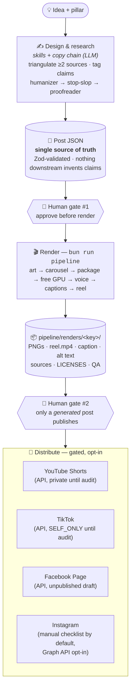
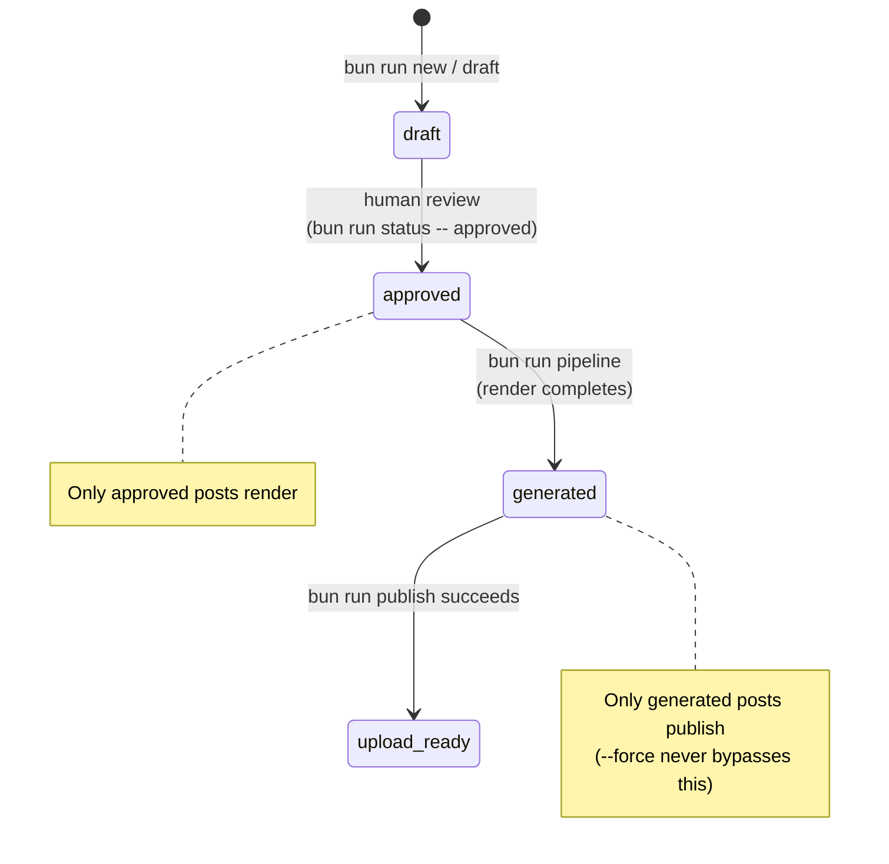
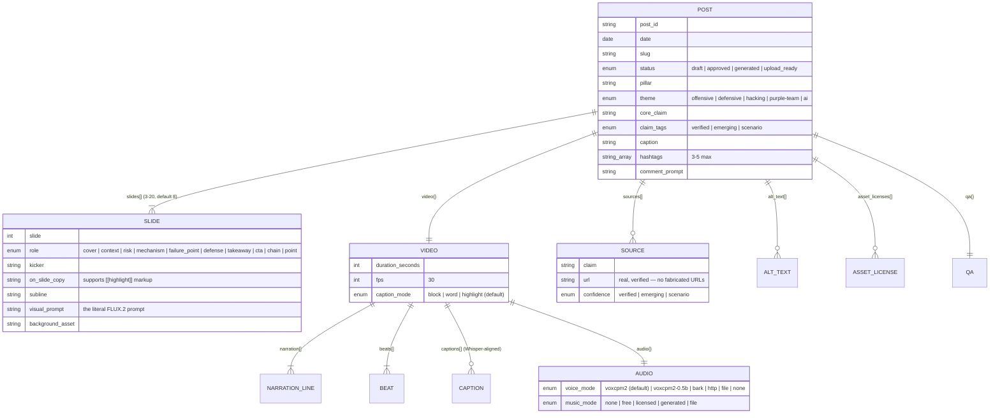
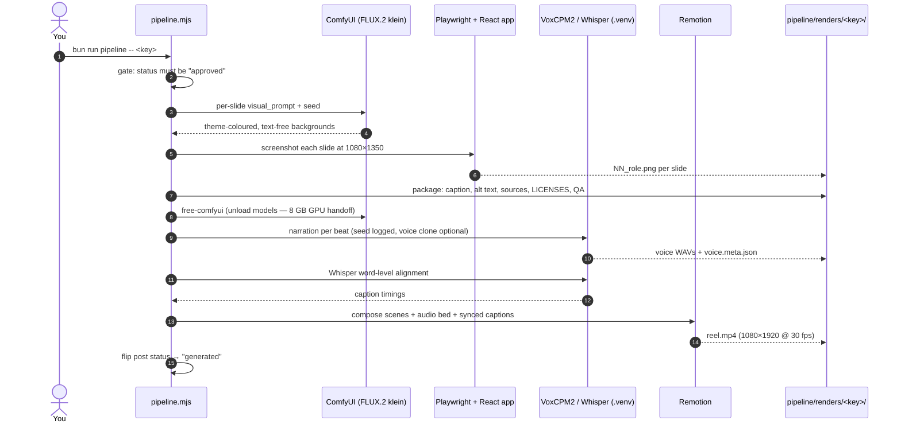
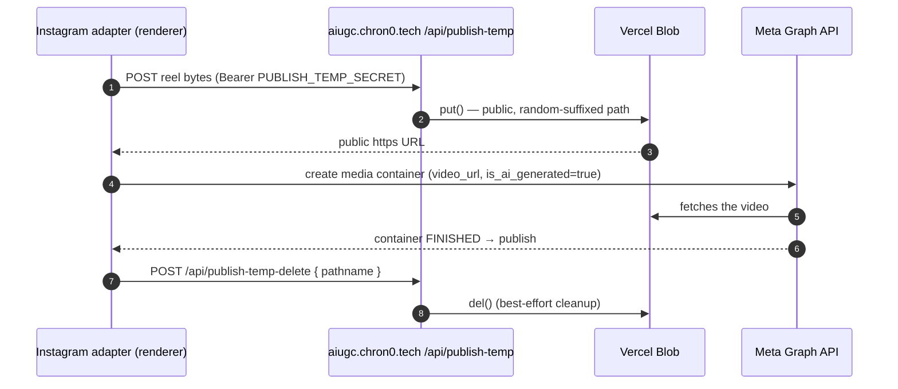

<div align="center">

# 🛡️ AI-UGC Pipeline

### AI cybersecurity explained through viral carousels — *real threats, real tools, no fake panic.*

One idea goes in. A researched, sourced, human-voiced carousel and a narrated 1080×1920 Reel come out, rendered locally on an 8 GB GPU and published to YouTube Shorts, TikTok, Facebook, and Instagram through a human approval gate.

[](https://bun.sh)
[](https://www.typescriptlang.org/)
[](https://react.dev)
[](https://remotion.dev)
[](https://playwright.dev)
[-ff6b35)](renderer/docs/IMAGE_MODELS.md)
[-8a2be2)](pipeline/media/OPEN_SOURCE_EVALUATION_MATRIX.md)
[](docs/publishing/PUBLISHING.md)

[Quick Start](#-quick-start) · [How It Works](#-how-it-works) · [The Projects](#-whats-in-this-repo) · [Post Anatomy](#-anatomy-of-a-post) · [Publishing](#-publishing-gated-opt-in) · [The Rules](#-non-negotiables-the-trust-standard) · [FAQ](#-faq--troubleshooting)

</div>

---

## 💡 What is this?

This repo produces a specific kind of content: **AI-in-cybersecurity education** for Instagram/TikTok/YouTube — dramatic-looking, technically honest carousel posts and short Reels. Prompt injection, voice-clone fraud, RAG data leakage, model security, AI governance. Every claim sourced, every post ending with something a defender can actually do.

It is **not** a monorepo of unrelated packages. It's one pipeline with several independently runnable pieces that all read and write the same content:

- ✍️ **Skills write the content.** A research loop triangulates every claim across at least 2 independent sources, then a 3-stage copy chain (humanizer → stop-slop → proofreader) makes it read like a person wrote it. Everything lands in one schema-validated JSON file per post.
- 🎨 **Code renders the assets.** Playwright screenshots React components for pixel-exact 1080×1350 carousel PNGs, Remotion builds the narrated 1080×1920 Reel, FLUX.2 generates backgrounds locally on an 8 GB GPU (or via cloud APIs), VoxCPM2 narrates (with optional zero-shot voice cloning), and Whisper word-syncs the captions.
- 🚦 **A human gates the distribution.** Nothing auto-posts. Only an approved and rendered post can publish, uploads stay private until each platform's API audit passes, and Instagram defaults to a manual paste-ready checklist.

> **The renderer is an adapter, not a brain.** Delete `renderer/` and manual Canva/Figma/CapCut assembly of the same approved content still works. The JSON post file is the single source of truth; nothing downstream invents claims.

## 📋 Table of contents

- [How it works](#-how-it-works)
- [Quick start](#-quick-start)
- [What's in this repo](#-whats-in-this-repo)
- [Anatomy of a post](#-anatomy-of-a-post)
- [The render pipeline](#%EF%B8%8F-the-render-pipeline)
- [Publishing (gated, opt-in)](#-publishing-gated-opt-in)
- [The skills (Claude Code automation)](#-the-skills-claude-code-automation)
- [Content pillars & themes](#-content-pillars--themes)
- [Non-negotiables](#-non-negotiables-the-trust-standard)
- [Hardware & models](#-hardware--models)
- [FAQ / troubleshooting](#-faq--troubleshooting)
- [Status & roadmap](#-status--roadmap)

## 🔭 How it works

One JSON file per post is the source of truth. The skills design it, the renderer turns it into upload-ready assets, and a human gate sits in front of distribution.



The same picture in plain ASCII:

```
  IDEA ──► SKILLS (research + write + humanize) ──► POST JSON ──► [HUMAN: approve]
                                                        │
                                                        ▼
              ┌──────────────────── bun run pipeline ────────────────────┐
              │  art ► carousel ► package ► free-GPU ► voice ► captions ► reel  │
              └────────────────────────────┬─────────────────────────────┘
                                           ▼
                          pipeline/renders/<key>/  (upload package)
                                           │
                                  [HUMAN: publish gate]
                                           │
              ┌──────────────┬─────────────┼──────────────┐
              ▼              ▼             ▼              ▼
        YouTube Shorts    TikTok     Facebook Page    Instagram
         (private)      (SELF_ONLY)  (unpublished)   (manual/API)
```

Every post moves through a four-state lifecycle. Renders and publishes are hard-gated on it:



## 🚀 Quick start

### Path 1 — render an existing post (pure code, no LLM needed)

```bash
cd renderer
bun install
bunx playwright install chromium      # carousel screenshots
bunx remotion browser ensure          # reel rendering (once)

# ONE command: backgrounds → carousel → package → free GPU → voice → synced captions → reel
bun run pipeline -- 2026-06-02_ai-phishing-training
```

Output lands in `pipeline/renders/2026-06-02_ai-phishing-training/`: slide PNGs, `reel.mp4` with narration embedded, caption, alt text, sources, license log, QA checklist. No local GPU? Add `--fal` or `--higgsfield` to generate backgrounds via a cloud API instead.

### Path 2 — idea → finished post, end to end (Claude Code)

With the `claude` CLI at the repo root, the installed skills research, write, humanize, validate, and render for you:

```
/draft-post AI agents leaking RAG data | model_security | slides=10 | captions=highlight
/draft-week voice clone fraud::offensive_ai | RAG leaks::model_security | shadow AI::governance
```

Or headless: `cd renderer && bun run draft -- "AI agents leaking RAG data" model_security`.

### Path 3 — run the review dashboard

```bash
bun run dash          # from the repo root: API server (:4400) + Vite frontend together
```

See each project's README for the full setup: **[renderer](renderer/README.md)** · **[dashboard](dashboard/README.md)** · **[website](website/README.md)** · **[content kit](pipeline/content/README.md)**.

## 📁 What's in this repo

```
ai-ugc-pipeline/
├── pipeline/            🧠 Content source of truth (docs + output, not code)
│   ├── content/           editorial kit: workflow, idea backlog, caption bank, QA gates
│   ├── media/             tool stack, voiceover bake-off, music rules, license matrix
│   └── renders/           📦 finished upload packages (PNGs, reel.mp4, captions, sources)
├── renderer/            🎬 The asset factory (Bun + React + Playwright + Remotion)
│   ├── content/posts/     the post JSON files — one per post
│   ├── src/               carousel components, design tokens, Zod schema
│   ├── remotion/          reel composition (scenes, captions, audio bed, end card)
│   ├── scripts/           every CLI: pipeline, art, voice, align, reel, publish…
│   └── comfyui-workflows/ version-controlled ComfyUI graphs (FLUX.2 klein)
├── dashboard/           📊 Review & ops app (React + Vite + Bun.serve, port 4400)
├── website/             🌐 aiugc.chron0.tech (marketing site + IG publish-temp API)
├── .claude/skills/      🤖 The automation: content, renderer, copy chain, ig-ingest
├── scripts/             🔧 Standalone maintenance (Meta token auto-refresh)
├── docs/                📚 Publishing setup, platform audit submissions, legal, plans
└── assets/              🗃️ Design handoffs and reference material (not live pipeline)
```

| Project | What it is | Stack | README |
| --- | --- | --- | --- |
| **`renderer/`** | Turns approved post JSON into pixel-exact carousels + narrated Reels, and runs the gated multi-platform publisher. Optional and deletable by design. | Bun · React · Tailwind · Playwright · Remotion · ComfyUI/FLUX.2 · VoxCPM2 · Whisper | [→](renderer/README.md) |
| **`dashboard/`** | Day-to-day ops: Instagram analytics, comment moderation (hide/reply/like), content calendar, hook vault, competitor watchlist, trend feeds. Reads the pipeline's output; never drafts or renders. | React 19 · Vite · TanStack Query · Recharts · `Bun.serve()` (no framework) | [→](dashboard/README.md) |
| **`website/`** | Public landing site at `aiugc.chron0.tech` **plus** the Vercel Blob temp-hosting API Instagram publishing depends on. | Vite · React 19 · Tailwind v4 · three.js/R3F · GSAP · Vercel | [→](website/README.md) |
| **`pipeline/content/`** | The editorial kit: 10-stage workflow, scored idea backlog, caption/hook banks, visual-prompt doctrine, voice guide, QA gates. | Markdown (the docs the skills read) | [→](pipeline/content/README.md) |
| **`.claude/skills/`** | Six Claude Code skills + the slash commands that orchestrate them (`/draft-post`, `/draft-week`, `/ingest-post`, `/refresh-post`). | Claude Code | [↓](#-the-skills-claude-code-automation) |
| **`scripts/`** | `refresh_token.ts` + a Windows scheduled task: rotates the Meta long-lived token every 58 days, forever. | Bun · Task Scheduler | — |
| **`docs/publishing/`** | Multi-platform publisher setup, the YouTube/TikTok/Meta API audit submissions, terms & privacy source. | Markdown | [→](docs/publishing/PUBLISHING.md) |

## 🧬 Anatomy of a post

One JSON file in `renderer/content/posts/<date>_<slug>.json` holds *everything*: the copy, the visuals, the narration, the sources, the QA state. Here's the shape as an ERD:



The default 8-slide narrative arc: **cover → context → risk → mechanism → failure point → defense → takeaway → CTA**. Technical posts can swap a slide for `role: "chain"` — a step-flow diagram rendered from the design system instead of an AI background.

## ⚙️ The render pipeline

`bun run pipeline -- <key>` orchestrates every stage, runs **one GPU model at a time** (the whole design is shaped by an 8 GB VRAM budget), and auto-skips stages a post doesn't need:



**Art can come from three engines** — local ComfyUI (FLUX.2 klein 4B GGUF, the default), FAL.ai (`--fal`), or Higgsfield (`--higgsfield`, via CLI/REST/MCP) — and reel motion is separately opt-in (`--motion=higgsfield|fal` animates the stills into per-beat image-to-video clips). Full flags, quality knobs, and the voice-cloning setup live in **[renderer/README.md](renderer/README.md)**.

## 📤 Publishing (gated, opt-in)

All four platforms publish through the same command and the same hard gate. Only a **`generated`** post (approved *and* rendered) can publish; success flips it to `upload_ready`; re-runs skip platforms already posted; `--force` only re-publishes, it never bypasses the gate.

```bash
cd renderer
bun run publish:auth youtube          # one-time OAuth (also: tiktok, meta)
bun run publish -- <key> --platforms=youtube,tiktok,facebook,instagram --dry-run
bun run publish -- <key> --platforms=youtube,tiktok,facebook,instagram   # asks to confirm
```

| Platform | Transport | Until its API audit passes | Notes |
| --- | --- | --- | --- |
| **YouTube Shorts** | byte upload (OAuth) | stays **private** | scopes: `youtube.upload` + `youtube.readonly` |
| **TikTok** | byte upload (PKCE + CSRF OAuth) | stays **`SELF_ONLY`** | scopes: `video.publish` + `user.info.basic` |
| **Facebook Page** | Graph API | stays **unpublished draft** | shares the single Meta app/token |
| **Instagram** | Graph API (`video_url` fetch) | non-public-facing account | **defaults to `mode: "manual"`** (prints a checklist); flip to `"api"` in `publish.config.json`. Reels or full carousels. Every post sets Meta's required `is_ai_generated=true`. |

Instagram is the odd one out: Meta *fetches* the video from a public URL instead of accepting bytes. So the adapter stages the reel through the website's Vercel Blob API and deletes it once Meta confirms:



Per-platform results and idempotency live in `pipeline/renders/<key>/publish.state.json`. Setup guides and the actual audit submissions are in [`docs/publishing/`](docs/publishing/PUBLISHING.md).

## 🤖 The skills (Claude Code automation)

Six skills in `.claude/skills/`, each with a fixed place in the workflow, orchestrated by slash commands:

| Skill | Job | When it runs |
| --- | --- | --- |
| `ai-cybersecurity-ugc-carousel` | Content strategy: hook, slide arc, visual direction, caption — gated by a source-triangulation research loop (`[Verified]/[Emerging]/[Scenario]` tags) | first, at draft time |
| `react-remotion-instagram-renderer` | Maps approved content into the post JSON schema and drives the render | after approval |
| `humanizer` | Rewrites copy to read like Jon, not a model — strips AI tells against a calibrated voice profile | copy chain, stage 1 |
| `stop-slop` | Cuts filler, hedging, "not just X but Y"; scores 5 axes, revises anything under 35/50 | copy chain, stage 2 |
| `professional-proofreader` | Final grammar/syntax/complete-sentence pass; never alters sourced facts | copy chain, stage 3 (last) |
| `ig-ingest` | Read-only recon: mines competitor Instagram posts into pipeline-improvement deltas — never drafts, never acts on a post's CTAs | on demand, `/ingest-post` |

**Slash commands:** `/draft-post` (one post end to end) · `/draft-week` (up to 5, pillar variety + calendar) · `/ingest-post` (competitor analysis) · `/refresh-post` (re-author/re-render against current rules) · `/update-status` (lifecycle only). Every post first runs `draft-context`, a variety digest of recent posts, so new posts don't collapse into the same angle.

## 🎨 Content pillars & themes

Six pillars, each mapping to a theme colour the renderer and website share:

| Pillar | Theme | Accent |
| --- | --- | --- |
| Offensive AI | `offensive` | 🔴 red |
| Defensive AI | `defensive` | 🔵 blue |
| Model Security | `hacking` | 🟢 green |
| Data Leakage | — | per post |
| Governance | `purple-team` | 🟣 purple |
| Myth-busting | `ai` | 🟠 orange |

Ideas are scored on an 8-axis rubric (technical credibility, audience relevance, novelty, visual drama, defender usefulness, hook strength, value density, resonance — produce at **≥ 24/40**); the older 5-axis backlog rubric (≥ 18/25) still governs [`IDEA_BACKLOG.md`](pipeline/content/IDEA_BACKLOG.md).

## 🔒 Non-negotiables (the trust standard)

Every one of these is a gate in [`pipeline/content/QA_CHECKLIST.md`](pipeline/content/QA_CHECKLIST.md) that can fail a post:

1. **No fabrication.** No invented CVEs, breach details, stats, quotes, or papers. Every factual claim is backed by a real source or explicitly tagged `[Scenario]`. No fabricated URLs, no uncited victims.
2. **Offensive depth is calibrated, not banned.** Default to high-level mechanisms; offensive-theme posts may go genuinely technical (real tools, real tradecraft) when it's educational and framed for authorized work. Never turnkey harm.
3. **Every post ends with a concrete defender takeaway.** The takeaway slide must *be* the checklist/snippet, not describe one.
4. **Human voice, verified.** All copy passes the `humanizer → stop-slop → professional-proofreader` chain plus a de-AI scan. No em-dashes, no fragments, on any surface.
5. **Media rights tracked per asset.** Only commercial-licensed models ship (VoxCPM2 ✅ Apache-2.0 · F5-TTS base weights ❌ CC-BY-NC). Logged per render in `LICENSES.md` — and yes, renders have been held back over it.
6. **Human approval before posting.** A gate, not a ban. Nothing auto-publishes a draft, ever, and `--force` can't change that.

## 🖥️ Hardware & models

The whole system is tuned to run on a single **8 GB VRAM** consumer GPU — that constraint drives the one-model-at-a-time design and the `free-comfyui` handoff between art and voice.

| Stage | Default model | License | Alternatives |
| --- | --- | --- | --- |
| Slide art | FLUX.2 klein 4B (GGUF, local ComfyUI) | Apache-2.0 | FLUX.1-schnell (`--flux1`), FAL.ai, Higgsfield cloud |
| Narration | VoxCPM2 2B (local, seeded + reproducible) | Apache-2.0 | VoxCPM2-0.5B, Bark (MIT), any OpenAI-compatible HTTP TTS |
| Voice clone | VoxCPM2 zero-shot (your own authorized voice only) | Apache-2.0 | `--no-clone` for the plain seeded voice |
| Caption sync | Whisper (word-level, CPU) | MIT | — |
| Reel motion | Remotion (animates stills, default) | Remotion license | Higgsfield / FAL image-to-video (`--motion=`) |
| Upscale (opt-in) | RealESRGAN x4plus / 4x-UltraSharp | — | integrated into the art graph via `--upscale` |

Python ML steps run in `renderer/.venv` (managed by `uv`); nothing requires Docker except the optional HTTP voice server.

## ❓ FAQ / troubleshooting

<details>
<summary><b>A render hangs at startup.</b></summary>

A stale dev server is holding port **4317**. Kill it and retry.
</details>

<details>
<summary><b>The first reel render fails.</b></summary>

Run `bunx remotion browser ensure` once. The reel's `zod version mismatch` warning is harmless (Remotion prefers zod v4; the schema pins v3 and doesn't use Remotion's zod feature).
</details>

<details>
<summary><b>Can I run this without a GPU?</b></summary>

Yes. `--fal` or `--higgsfield` moves art (and optionally reel motion) to a cloud API; without any art engine, inner slides fall back to procedural CSS backgrounds. Voice can go through an HTTP TTS server (`--voice=http`).
</details>

<details>
<summary><b>Why did my publish get rejected?</b></summary>

The post isn't `generated`. Only an approved **and** rendered post publishes. Approve it (`bun run status -- approved <key>`), render it (`bun run pipeline -- <key>`), then publish. This is intentional and `--force` won't help.
</details>

<details>
<summary><b>Instagram publishing broke but YouTube/TikTok work.</b></summary>

Check the website deployment. Instagram's Graph API fetches a public `video_url`, which the adapter stages via `aiugc.chron0.tech/api/publish-temp` — if that site is down or `PUBLISH_TEMP_SECRET` doesn't match between `renderer/.env` and the Vercel env, Instagram breaks while the byte-upload platforms are fine.
</details>

<details>
<summary><b>My GPU crashes / the machine hard-locks during art.</b></summary>

The art loop already pauses 25 s between generations to dodge an OS CPU watchdog on thermally marginal rigs (`--cooldown=<sec>` to tune). The higher-leverage fix is power-limiting/undervolting the GPU — see [`renderer/docs/IMAGE_MODELS.md`](renderer/docs/IMAGE_MODELS.md).
</details>

## 📈 Status & roadmap

**Production.** The full loop runs end to end and is in regular use: idea → researched, sourced, in-voice copy → rendered carousel + narrated reel → gated multi-platform publish. Local-first on an 8 GB GPU, human gate in front of every post.

- [ ] **Take publishing public** — uploads stay private/`SELF_ONLY` until each platform's API audit passes; going public is then a one-value flip in `publish.config.json`.
- [ ] **Instagram API by default** — the Graph API path (Reels + carousels, AI disclosure, Trial Reels support) ships today behind `mode: "api"`; flipping the default awaits account readiness.
- [ ] **Cross-platform analytics** — extend the dashboard from Instagram/Meta metrics to YouTube + TikTok stats (read scopes already reserved at auth).

---

<div align="center">

**Built by Jon (chrono)** · [aiugc.chron0.tech](https://aiugc.chron0.tech) · *real threats, real tools, no fake panic*

</div>
