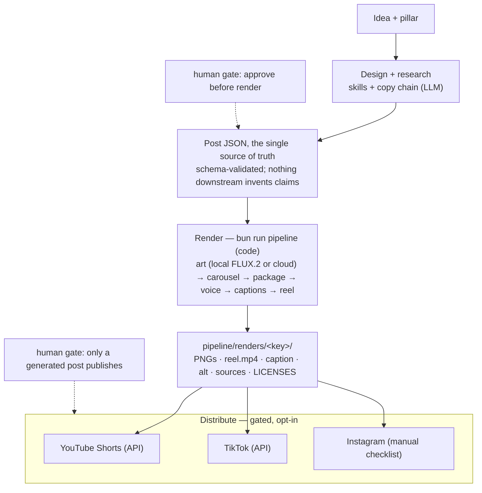

# AI-UGC Pipeline

**AI cybersecurity explained through viral carousels: real threats, real tools, no fake panic.**

A content production system for AI-in-cybersecurity UGC — Instagram-style carousels and short-form Reels — plus an optional React/Remotion rendering layer that turns approved posts into pixel-exact assets, and a gated publisher for YouTube Shorts + TikTok.

> **Publishing:** YouTube Shorts and TikTok publish through a gated `bun run publish` (only a rendered+approved post, with dry-run/confirm). **Instagram stays manual** (Meta API access pending) — the pipeline emits a paste-ready upload checklist. Nothing auto-posts; a human gate is always in front. See [`docs/publishing/PUBLISHING.md`](docs/publishing/PUBLISHING.md).

---

## What's here

This isn't a monorepo of unrelated packages — it's one pipeline with several independently runnable pieces. `pipeline/` is the content source of truth, `renderer/` turns it into assets, `dashboard/` and `website/` are separate Bun/Vite apps that operate on and around that output, and `.claude/skills/` + `scripts/` are the automation that glues it together.

| Folder | What it is |
| --- | --- |
| [`pipeline/content/`](pipeline/content/) | The content kit — workflow, scored idea backlog, post template, caption bank, visual prompts, QA gates, Week-1 carousels. |
| [`pipeline/media/`](pipeline/media/) | The media/video kit — modular tool stack, voiceover bake-off, b-roll prompts, music/SFX rules, video assembly, verified open-source tool evaluation. |
| [`renderer/`](renderer/) | Optional React + Tailwind + Playwright (carousels) and Remotion (Reels) rendering layer. Turns approved post JSON into deterministic assets. |
| [`pipeline/renders/`](pipeline/renders/) | Upload-ready output packages (rendered PNGs + reel MP4 + caption/alt/sources/licenses/QA). |
| [`dashboard/`](dashboard/) | Standalone React + Vite + Bun app for reviewing post performance, comments, and scheduling — separate `bun install`/dev server from the renderer. |
| [`website/`](website/) | Standalone Vite + React + Three.js marketing site (`aiugc.chron0.tech`), deployed independently on Vercel; also hosts the temp-blob API the Instagram publisher needs. |
| [`.claude/skills/`](.claude/skills/) | The Claude Code skills that do the writing/rendering/voice work (see [Skills](#skills-claudeskills)). |
| [`scripts/`](scripts/) | Standalone maintenance scripts, e.g. the Instagram long-lived-token refresher (scheduled task, not part of a render). |
| [`docs/`](docs/) | Cross-cutting docs: platform publishing/audit submissions, legal policy pages, project plans, and the local `superpowers` skill mirror. |
| [`assets/`](assets/) | Project handoffs, skills, and the original demo image assets (3 finished carousels + text-free cover backgrounds). |

## How it fits together

One JSON file per post is the source of truth: it's *designed* by the skills, *rendered* into upload-ready assets, then *distributed* through a human gate. Nothing downstream invents claims, and nothing posts without approval.



The 10-stage content workflow lives in [`pipeline/content/CONTENT_PIPELINE.md`](pipeline/content/CONTENT_PIPELINE.md); the system design is in [`renderer/docs/PROJECT_ARCHITECTURE.md`](renderer/docs/PROJECT_ARCHITECTURE.md) (layers + the post-JSON model), [`renderer/docs/PIPELINE_ARCHITECTURE.md`](renderer/docs/PIPELINE_ARCHITECTURE.md) (the render engine), and [`renderer/docs/PUBLISHING_ARCHITECTURE.md`](renderer/docs/PUBLISHING_ARCHITECTURE.md) (the gated publisher). The renderer is an **adapter, not a brain** — delete it and manual Canva/Figma/CapCut assembly of the same approved content still works.

## The sub-projects

Each of these has its own dependencies and dev server; none of them are optional pieces of a single build; they're separate apps that read/write the same `pipeline/` and `renderer/` output.

### `renderer/` — content → assets

An **optional, deletable** Bun + React + Tailwind + Playwright (carousel screenshots) + Remotion (Reel video) rendering layer, sitting at Stage 8 ("Assemble") of the 10-stage content workflow. It turns an *approved* post JSON file into pixel-exact 1080×1350 carousel PNGs and a narrated 1080×1920 Reel MP4, packages them for upload, and runs the gated multi-platform publisher. Delete it and manual Canva/Figma/CapCut assembly of the same approved content still works — it's an adapter, not a brain. Two entry points exist: `draft`/`draft-week` (idea → researched JSON → render, end to end) and `pipeline` (render-only, for an already-drafted/approved post).

**Full command reference** (`renderer/package.json`):
| Command | Does |
| --- | --- |
| `dev` / `build` / `preview` | Vite dev server (`:4317`) / production build / preview. |
| `new` | Scaffold a blank post JSON (`--slides=N`, theme, captions mode). |
| `draft` / `draft-week` | Idea + pillar → researched, humanized, schema-valid post JSON → rendered (single post / up to 5 with pillar variety + calendar). |
| `draft-context` | Variety digest of recent posts (overused hooks/motifs/angles) so new posts stay distinct. |
| `validate` | Check a post JSON against the Zod schema. |
| `status` | Set post lifecycle status (`draft/approved/generated/upload_ready`). |
| `export` | Playwright screenshot export — one PNG per slide. |
| `package` | Write the caption/alt-text/sources/licenses/QA upload package. |
| `art` / `art:fal` / `art:higgsfield` / `art:diffusers` | Generate slide backgrounds: local ComfyUI (FLUX.2 klein default, `--flux1` legacy), FAL.ai cloud, Higgsfield cloud (CLI/REST/MCP), or legacy in-process diffusers. |
| `higgsfield:models` | List Higgsfield models + per-image credit cost. |
| `upscale` | Standalone GAN upscale pass on existing backgrounds. |
| `import-bg` | Import an existing background asset into a post. |
| `free-comfyui` | Unload ComfyUI models to free VRAM for the voice/align GPU handoff. |
| `voice` | Generate narration audio (VoxCPM2 default, Bark, or HTTP TTS server). |
| `align` | Whisper word-level sync for captions. |
| `reel` / `reel:fal` / `reel:higgsfield` | Build the Remotion reel locally, or with cloud image-to-video motion per beat. |
| `pipeline` | The one-command orchestrator: art → export → package → free-comfyui → voice → align → reel → optional publish. |
| `publish` / `publish:auth` | Gated multi-platform publish (YouTube/TikTok/Facebook/Instagram); one-time OAuth per platform. |
| `test` / `test:smoke` | Bun test runner / Playwright fit-smoke test. |
| `typecheck` | `tsc --noEmit` for both the app and the separate Remotion `tsconfig.json`. |
| `remotion:studio` | Launches Remotion Studio for interactive reel preview/debugging. |
| `lint` / `lint:fix` | Biome. |

**Architecture layers:** post JSON (Zod-validated, `src/lib/schema.ts`) → **art generation** (local ComfyUI/FLUX.2 klein or cloud FAL/Higgsfield) → **carousel rendering** (React components under `src/components/carousel/`, captured via Playwright at exact 1080×1350 — `App.tsx` is a query-param router with no router library, `?post=&slide=` for single-slide capture, and sets `data-render-ready="1"` after fonts/images load + 2 RAFs, which Playwright polls for) → **packaging** (`scripts/build-package.ts` writes caption/alt/sources/licenses files) → **voice/TTS** (VoxCPM2 2B default, zero-shot voice cloning supported) → **caption alignment** (Whisper word-level timing) → **Remotion reel composition** (`remotion/ReelComposition.tsx` assembles `Scene.tsx`, `CaptionLayer.tsx`/`CaptionTrack.tsx`, `AudioBed.tsx`, `EndCard.tsx`) → **publishing** (gated adapters under `scripts/publish/` for YouTube/TikTok/Facebook/Instagram, including shared PKCE/CSRF OAuth loopback logic). A hard GPU-memory boundary drives the design: on 8 GB VRAM, ComfyUI and VoxCPM2/Whisper can't coexist, so `free-comfyui` unloads models between the art and voice stages (skipped entirely with cloud art).

**Key subdirectories:** `src/` (the Vite/React app — `design/tokens.ts` is the design system: palette, per-pillar/theme accents, canvas geometry, type scale, safe zones; `lib/` holds the Zod schema, post loader, caption-export, and content-check logic, each with a paired test); `scripts/` (every CLI entrypoint above, plus `scripts/publish/adapters/` and `scripts/lib/` shared helpers); `remotion/` (reel composition components); `comfyui-workflows/` (version-controlled ComfyUI workflow JSON, e.g. `flux2_klein_4b_8gb.json` + `_with_upscale` variant, used with `--ui-format`); `content/posts/` (the actual post JSON files — see schema below); `public/` (`audio/<post-key>/`, `backgrounds/<post-key>/`, `video/<post-key>/`, `walls/` theme background pairs); `docs/` (15 markdown files: architecture, publishing, image models, content schema, run-it-yourself).

**Post JSON schema** (one file per post, `renderer/content/posts/`): top-level `post_id, date, slug, platform, format, status` (lifecycle), `pillar, theme, audience, core_claim, claim_tags[]` (`verified`/`emerging`/`scenario`), `score{...}`, `canvas{}`, `brand{}`, `upload_package{}`, `slides[]`, `caption`, `hashtags[]`, `comment_prompt`, `alt_text[]`, `sources[]`, `asset_licenses[]`, `video{}`, `qa{}`. Each slide has `slide, role, kicker, on_slide_copy` (supports `[[highlight]]` markup), `subline, visual_direction, visual_prompt, background_asset, asset_status, cta, notes` — default 8-role shape `cover → context → risk → mechanism → failure_point → defense → takeaway → cta`. `video{}` holds `duration_seconds, fps, export_name, caption_mode` (block/word/highlight), `audio{voice_mode, music_mode, ...}`, `narration[]`, `beats[]`, and Whisper-aligned `captions[]`.

**Notable flags:** art — `--flux1`, `--fal`/`--higgsfield` (+ `--higgsfield-mode=cli|rest|mcp`, `--higgsfield-model=`/`--fal-model=`, `--budget=N` default 20), `--passes=N` (4–8 rec, max 12), `--q6`, `--upscale` (+ `--upscale-model=`/`--upscale-scale=`), `--ui-format`, `--cooldown=<sec>`/`ART_COOLDOWN_MS` (default 25s, thermal watchdog avoidance). Reel — `--motion=local|higgsfield|fal` (+ `--motion-model=`/`--motion-budget=` default 60), `--captions=block|word|highlight` (default highlight), `--custom-voice path.wav` (+ `--custom-voice-text`, `--no-hifi`, `--no-clone`), `--seed=N`, `--voice=voxcpm2|voxcpm2-0.5b|bark|http|none`. Pipeline-level — `--status=approved` (batch by lifecycle status), `--dry-run`, `--publish=youtube,tiktok`, `--no-art`/`--no-voice`/`--no-reel`.

**Tests:** `bun test` plus a Playwright smoke test (`test:smoke`). Coverage includes art prompt composition, FAL/Higgsfield API clients, post scaffolding, publish adapters (Instagram/TikTok/YouTube), OAuth/Meta auth, publish state/idempotency, Zod schema validation, fit-to-frame math, caption export, and content QA checks.

**Load-bearing gotchas:** 8 GB VRAM drives the one-model-at-a-time design and the mandatory `free-comfyui` GPU handoff. Licensing is tracked per-asset in each post's `asset_licenses[]` (FLUX.2 klein/FLUX.1-schnell/VoxCPM2 are Apache-2.0 and shippable; F5-TTS base weights are CC-BY-NC and banned commercially). Publishing is hard-gated — only `generated` (approved AND rendered) posts can publish, `--force` never bypasses the gate, Instagram requires a publicly-fetchable video so the adapter stages reels through the `website/`'s temporary Vercel Blob upload/delete cycle, and every Instagram post sets Meta's required `is_ai_generated=true`. A stale dev server on port 4317 and a one-time `bunx remotion browser ensure` are the two most common first-run trip-ups. See [`renderer/README.md`](renderer/README.md) and [`renderer/docs/`](renderer/docs/) (`PROJECT_ARCHITECTURE.md`, `PIPELINE_ARCHITECTURE.md`, `PUBLISHING_ARCHITECTURE.md`, `IMAGE_MODELS.md`, `RUN_IT_YOURSELF.md`) for the full detail.

### `dashboard/` — review, moderation, and scheduling UI

A separate React 19 + Vite 6 + Bun app (its own `bun install`, not shared with `renderer/`) for working with posts and Instagram/Meta data day to day. It's read/write against the *output* of the pipeline (rendered packages, publish state, cached Graph API data) — it never drafts or renders content itself. There's no runtime web framework: the backend is a single `Bun.serve()` process doing manual URL routing, and the frontend uses TanStack Query for data fetching and `recharts` for charts.

**Scripts** (`dashboard/package.json`):
| Script | Does |
| --- | --- |
| `bun run dev` | Vite dev server for the React frontend only. |
| `bun run server` | Runs `server/index.ts` — the Bun API server on port 4400. |
| `bun run dash` (repo root) → `dashboard/scripts/dash.ts` | Spawns both `server/index.ts` and `bunx vite` concurrently (stdio inherited from both), kills both on SIGINT. This is the normal way to run the dashboard locally. |
| `bun run lint` / `lint:fix` | Biome check (`bunx --bun biome check .`). |
| `bun run test` | `bun test server src` — unit tests for both the server modules and frontend lib code. |
| `bun run e2e` | `playwright test e2e` — browser tests against the running app. |

**Frontend screens** (`dashboard/src/modules/`, one component per folder):
- **`overview/Overview.tsx`** — landing dashboard: 7-day IG views, avg engagement, posts-rendered-in-7-days, hook vault size, watchlist size, a queued-slots preview, and a count of hook-worthy trends. Pulls from nearly every other module's data sources (`/api/ig/account`, `/api/ig/media`, `/api/repo/posts`, `/api/repo/hooks`, `/api/repo/ingested`, `schedule.json`, `hooks-meta.json`, `/api/trends`).
- **`analytics/Analytics.tsx`** — deep Instagram performance analysis: engagement rate, reel watch-time, saves/shares benchmarks, best-day/best-time bar charts, hashtag stats, top/bottom performing posts, and a sortable full post grid. Shows an "INSIGHTS UNAVAILABLE" banner if the Graph API call fails for lack of the `instagram_manage_insights` scope.
- **`calendar/Calendar.tsx`** — month-grid content calendar merging scheduled items (`schedule.json`) with rendered-but-unscheduled packages, color-coded by target platform; clicking a day slot lazily loads that package's caption/sources/slide thumbnails.
- **`comments/Comments.tsx`** — Instagram comment moderation: pick a post, list its comments, then hide/unhide, delete, reply, **like/unlike**. Like/unlike (`POST`/`DELETE /api/comments/:id/like`) is the newest feature (commit `20560fc`).
- **`competitors/Competitors.tsx`** — a watchlist of competitor/creator handles (stored in `hooks-meta.json`), grouped ingested-post analyses (from `/api/repo/ingested`, i.e. `pipeline/content/ingested/`), flags new docs since last visit, and a one-click copy of `/ingest-post <url>`.
- **`hooks/HookVault.tsx`** — searchable library of hooks aggregated across posts, ingested analyses, and the caption bank; lets you tag a hook's type (swap/build/claim/list/contrarian) and copy a ready-to-run `/draft-post <hook> | <pillar>` command. Exports the shared `HooksMeta` type and `PILLARS` constant used by Competitors and Trending.
- **`meta/Meta.tsx`** — published-post analytics across Facebook + Instagram (via `/api/meta/insights`, which joins `publish.state.json` with live Graph API metrics): reach chart over the last 20 posts, per-post cards with AI-disclosure/privacy/hashtag badges and views/reach/likes/comments/saves/shares. Shows a "META NOT CONNECTED YET" state if no token is configured.
- **`scheduler/Scheduler.tsx`** — a **planning-only** posting queue (explicitly does not publish anything): queue a rendered package for a date/time, toggle target platforms per item, mark posted/skipped. Purely writes to `dashboard/data/schedule.json`.
- **`trending/Trending.tsx`** — RSS/Atom trend feed reader (sources in `dashboard/data/sources.json`, currently Hacker News, BleepingComputer, Simon Willison); tag items hook/explainer/skip and copy a `/draft-post <title> | <pillar>` command. Warns about dead/failing sources.

**Backend** (`dashboard/server/`, a single `Bun.serve()` on port 4400, no framework):
- **`index.ts`** — the route table: `/api/health`, `/api/ig/*` (account, media, token-age), `/api/repo/*` (posts, renders, ingested, hooks, plus path-traversal-guarded reads of a render's `caption.txt`/`sources.md`/slide PNGs), `/api/meta/*` (published, insights), `/api/trends`, `/api/comments/*` (list/delete/hide/reply/like/unlike), and a generic `/api/state/:name` GET/PUT gated by an allowlist. Every response is wrapped `{data, error, fetchedAt}`; `?refresh=1` bypasses cache.
- **`ig.ts`** — the core Instagram Graph API client plus a generic disk-cache helper (`fetchWithCache`, 6h default TTL) reused by `trends.ts` and `meta.ts`. Resolves credentials from `IG_ACCESS_TOKEN`/`IG_USER_ID` env vars first, falling back to `renderer/.secrets/meta.json`. Handles Graph API quirks like `views` not being a valid metric for image/carousel media.
- **`meta.ts`** — reads `pipeline/renders/<key>/publish.state.json` to list published Facebook/Instagram posts and joins in live insights (likes/comments/reach/etc.) from the Graph API.
- **`meta_auth.ts`** — read-only accessor for `renderer/.secrets/meta.json` (the same file the renderer's `bun run publish:auth meta` OAuth flow writes) and the `appsecret_proof` HMAC helper required on every authenticated Graph API call.
- **`comments.ts`** — comment moderation against `graph.facebook.com/v25.0` using the Page token: `listComments`, `setCommentHidden`, `deleteComment`, `replyToComment`, `likeComment`, `unlikeComment`.
- **`hooks.ts`** — pure aggregation logic (no network): parses the caption bank's hook-formula table and merges/dedupes hooks across posts, ingested docs, and the caption bank into `HookRow[]`.
- **`repo.ts`** — reads the renderer/pipeline repo structure directly off disk: post JSON under `renderer/content/posts/`, render packages under `pipeline/renders/`. Skips unparseable post files with a warning instead of failing the whole request.
- **`trends.ts`** — fetches and parses the RSS/Atom feeds listed in `sources.json` in parallel (`Promise.allSettled`, 10s timeout, 1h cache), reporting any dead sources.
- **`store.ts`** — a tiny JSON key-value store for dashboard UI state, restricted to an allowlist of three files (`schedule.json`, `hooks-meta.json`, `sources.json`).
- **`paths.ts`** — the single source of truth for every path the dashboard touches, including `renderer/.secrets/meta.json`, `renderer/content/posts/`, `pipeline/renders/`, `pipeline/content/ingested/`, and `pipeline/content/CAPTION_BANK.md`. This is what lets the dashboard live in its own folder while still reading the renderer/pipeline's output.

**Data & caching** (`dashboard/data/`): only `schedule.json` (the scheduler's queue — id/renderDir/date/time/platforms/status) and `sources.json` (the trend feed list) are checked into git as hand-edited source of truth. `ig-cache/`, `trends-cache/`, and `meta-cache/` are runtime-generated, gitignored disk caches for Graph API/RSS responses (per the TTLs in `ig.ts`/`trends.ts`).

**Credentials — shared with the renderer, not a separate app.** The dashboard has no `.env.example` and almost no env vars of its own: `IG_ACCESS_TOKEN`/`IG_USER_ID` (optional override) and `META_APP_SECRET` (required for `appsecret_proof` on every Graph call), all read in `dashboard/server/ig.ts`/`comments.ts`/`meta.ts`. Absent an explicit token override, the dashboard reads the **same** `renderer/.secrets/meta.json` that the renderer's `bun run publish:auth meta` OAuth flow writes — this is the "unify dashboard IG credentials with renderer's Meta OAuth login" fix (commit `079501d`): before that, the dashboard had its own separate IG login path. The comment **like/unlike** feature added in `20560fc` needed no new OAuth flow at all — it turned out `/{ig-user-id}/likes` is part of the same classic Instagram Graph API, so it only required adding the `instagram_manage_engagement` scope to the existing shared Meta token (see the `comments.ts` header comment, which notes an earlier, incorrect attempt had tried building a second parallel OAuth flow just for this).

```bash
cd dashboard
bun install
bun run dev      # Vite dev server (frontend only)
bun run server   # API server on :4400 (Meta Graph API + repo data)
# or from the repo root: bun run dash    (runs both together, kills both on Ctrl+C)
```

**Testing:** unit tests (`bun run test` → `bun test server src`) cover most server modules (`hooks`, `ig`, `ingested`, `meta`, `meta_auth`, `repo`, `store`, `trends` each have a `.test.ts`). E2E (`bun run e2e` → Playwright) lives in `dashboard/e2e/`: `meta.spec.ts` stubs `/api/meta/insights` to verify both the populated Meta tab and the "META NOT CONNECTED YET" empty state; `screenshots.spec.ts` clicks through every nav tab (Overview, Hook Vault, Analytics, Competitors, Scheduler, Calendar, What's Trending, Meta) and screenshots each to `e2e/shots/`.

### `website/` — public landing site (and quiet IG-publishing infra)

Two jobs live in this one small Vite app. First, the **public marketing site** for "Chrono's Cyber World of AI" at `aiugc.chron0.tech`: Vite + React 19 + TypeScript + Tailwind v4 (via `@tailwindcss/vite`, no PostCSS config), a three.js/`@react-three/fiber` hero, and GSAP-choreographed load/scroll motion — plus the `/terms` and `/privacy` pages required by the TikTok/YouTube/Meta app applications. Second, and easy to miss: `website/api/publish-temp.ts` and `publish-temp-delete.ts` are Vercel serverless functions that give the renderer's Instagram adapter a public HTTPS URL, because IG's Graph API (unlike YouTube/TikTok's byte-upload model) requires *fetching* a `video_url`. **If this site is down or misconfigured, Instagram publishing breaks even though the renderer itself is fine** — YouTube/TikTok are unaffected since they don't need this relay.

**Scripts** (`website/package.json`): `dev` (`vite --port 4319 --strictPort`), `build` (`tsc -b && vite build`), `preview` (`vite preview --port 4319 --strictPort`, "smoother than dev" per the README), `lint`/`lint:fix` (Biome).

**Routes** (`src/App.tsx`, `react-router-dom`): `/` → `pages/Home.tsx` stacking `Nav → Hero → Thesis → Pillars → Pipeline → Story → CTA → Footer` (each section in `src/sections/*.tsx`, copy centralized in `src/lib/content.ts`) — Hero has the full-viewport three.js canvas behind scrambled headline text with GSAP fade-ins; Thesis frames the brand's "AI changed both sides of security" argument; Pillars renders the five content pillars/themes as a colored card grid matching the renderer's `theme=` option; Pipeline is a 4-step "I build the tools I post about" strip ending in the same non-negotiables listed below; Story introduces "Jon, who goes by chrono." `/terms` and `/privacy` both render `pages/Legal.tsx` with structured content from `src/lib/legal.ts`. A catch-all falls back to `Home`; `@vercel/analytics`'s `<Analytics />` is mounted at the app root.

**Three.js hero** (`src/three/HeroCanvas.tsx`): a custom `SignalField` of ~2800 points (1200 on mobile) on a golden-angle Fibonacci sphere, colored through a 5-stop gradient matching the brand's theme colors, with custom GLSL shaders for twinkle + glow (no post-processing bloom pass needed). Includes a hand-rolled `FpsGuard` (drops pixel ratio if FPS sustains below 45 for 3 windows, avoiding pulling in the whole `drei` barrel), pointer-reactive rotation (disabled under `prefers-reduced-motion`), an `IntersectionObserver`-driven `frameloop` pause when scrolled out of view, and `lazy()` code-splitting so the three.js bundle doesn't block first paint.

**Deployment** (`vercel.json`, `website/README.md`): **Root Directory must be set to `website`** in the Vercel project — the repo root is not the site. Framework preset Vite, build `vite build`, output `dist`, install via bun. `vercel.json`'s single rewrite (`/(.*)`  → `/index.html`) makes `/terms`/`/privacy` resolve under the client-side router instead of 404ing. Domain: `aiugc.chron0.tech`.

**The publish-temp API (the load-bearing part):**
- **`api/publish-temp.ts`** (POST) — reads the raw request body itself (`bodyParser: false`, since it receives raw video bytes not JSON); checks `Authorization: Bearer ${PUBLISH_TEMP_SECRET}` (401 if unset/mismatched — this is a shared-secret pipeline↔deployment handshake, not end-user auth); uploads via `@vercel/blob`'s `put()` to `publish-temp/${Date.now()}-${filename}` (`access: "public"`, `contentType: "video/mp4"`, `addRandomSuffix: true`); returns `{ url, pathname }` — `url` becomes Instagram's `video_url`.
- **`api/publish-temp-delete.ts`** (POST) — same auth check; takes `{ pathname }`; calls `@vercel/blob`'s `del()`; returns `{ deleted: true }`.
- **Caller side** (`renderer/scripts/publish/adapters/lib/temp-hosting.ts`): `uploadTemp()` POSTs the local reel file to `https://aiugc.chron0.tech/api/publish-temp` (overridable via `PUBLISH_TEMP_HOST`) and throws early with a clear message if `PUBLISH_TEMP_SECRET` isn't set; `cleanup()` is **best-effort** — failures are silently swallowed ("a failed delete leaves an orphaned blob, not a broken publish"). The Instagram adapter enriches the error message with a hint to set `PUBLISH_TEMP_SECRET` in `renderer/.env` "(matches the Vercel env var on aiugc.chron0.tech)" — the same secret value must be configured in both places.
- The functions are intentionally minimal: no rate limiting, no logging beyond error passthrough, no persistent record of in-flight uploads — correctness relies entirely on the caller's best-effort cleanup and timestamp/random-suffix path naming to avoid collisions.

```bash
cd website
bun install
bun run dev        # http://localhost:4319
bun run build       # type-check + production build
```

### `.claude/skills/` — the automation (mirrored at `skills/`)

Six skills, each with a distinct job and a fixed place in the workflow:

- **`ai-cybersecurity-ugc-carousel`** — the content-strategy skill; invoked first when drafting a post idea/carousel/caption/calendar. Produces the cover hook, an 8-slide (configurable 3–20) narrative arc, per-slide visual direction, caption, and QA notes, gated by a source-triangulation/confidence-tiering research loop (`[Verified]/[Emerging]/[Scenario]`) and a credibility/safety gate.
- **`react-remotion-instagram-renderer`** — the schema/rendering skill; invoked once content is approved to map it into the post JSON schema (slides, brand tokens, video object) and drive the React+Playwright/Remotion render. Defines the canonical slide roles and the resolution/overflow/source-support/cyber-safety/media-rights QA gates.
- **`humanizer`** — first stage of the copy chain. Rewrites caption/narration/on_slide_copy to read like Jon, stripping AI tells (em-dashes, "delve/leverage," negative parallelism, generic CTAs) via a strip → re-voice → audit pass against `references/voice-profile.md`. Never changes facts, only how they read.
- **`stop-slop`** — second stage. Cuts throat-clearing, filler/hedging, jargon, and "not just X but Y" clichés, then scores the copy across five axes (directness, rhythm, trust, authenticity, density), revising anything under 35/50. Adapted (MIT) from `hardikpandya/stop-slop`.
- **`professional-proofreader`** — final stage, run last before validation. Fixes grammar/spelling/punctuation/syntax, checks every line is a complete spoken sentence (not a fragment), and enforces dash hygiene (banned em-dashes, glued hyphenated compounds). Never alters sourced facts.
- **`ig-ingest`** — a separate, read-only reconnaissance skill (not part of the content-creation chain). Captures an Instagram URL via Claude-in-Chrome, extracts slide map/caption anatomy/claims, and proposes reviewable "pipeline deltas" to repo templates/skills — never drafts a post, never acts on the post's CTAs.

**Slash commands** (`.claude/commands/*.md`) orchestrate the skills above: `/draft-post` runs the full idea→JSON→copy-chain→render pipeline for one post; `/draft-week` batches up to 5 with pillar variety and a posting calendar; `/ingest-post` wraps `ig-ingest` for one or more URLs, applying deltas only on explicit `apply=yes`; `/refresh-post` re-authors/re-renders an already-generated post against current rules with a `scope=art|copy|prompts|reel|research|all` selector; `/update-status` is a pure lifecycle-status setter with no rendering. See the CLAUDE.md `Skills` section for the copy-chain order (`humanizer → stop-slop → professional-proofreader`).

### `scripts/` — standalone maintenance

Scripts that run outside any render, on their own schedule:
- **`refresh_token.ts`** — reads `META_APP_ID`/`META_APP_SECRET` from `renderer/.env` and the current Page token from `renderer/.secrets/meta.json` (the same files `renderer/scripts/publish/auth/meta.ts` uses), calls the Meta Graph API's long-lived-token exchange endpoint, and rewrites *only* `page_access_token` in `meta.json` (via an exported `mergeToken` helper that preserves every other field) — success is logged to `dashboard/token_refresh.log`, failure exits 1 without touching the secrets file.
- **`refresh_token.test.ts`** — unit tests for `mergeToken` (preserves all fields but the token); doesn't test the live network call.
- **`register_token_task.ps1`** — registers a Windows Task Scheduler job that runs `bun scripts/refresh_token.ts` every 58 days (just under Meta's 60-day long-lived-token expiry), so the IG token refreshes indefinitely without manual intervention.

### `docs/` — cross-cutting docs

- **`docs/publishing/`** — the multi-platform publisher's setup guide (`PUBLISHING.md`), the Meta integration spec, and the per-platform API audit submissions (`META_AUDIT_SUBMISSION.md`, `TIKTOK_AUDIT_SUBMISSION.md`, `YOUTUBE_AUDIT_APPLICATION.md`).
- **`docs/publishing/legal/`** — `terms.md`/`privacy.md`, the source content served by the website's `/terms` and `/privacy` routes and referenced by the platform audits.
- **`docs/plans/`** — dated implementation plans, e.g. a pass to DRY `renderer/scripts/*.mjs` into a shared `renderer/scripts/lib/` layer without changing CLI behavior.
- **`docs/superpowers/`** — a local mirror of the `writing-plans`/`executing-plans` design-doc convention: paired `plans/` (dated implementation plans: content dashboard, readable-tech-posts, multi-platform publishing, Instagram login/comment-engagement) and `specs/` (matching design docs plus extras like a batch-run-by-status design and an xAI adapter design).

### `pipeline/` — the content source of truth (not code)

`pipeline/` is docs and generated output, not an app — it's what the skills read to write a post, and where a rendered post ends up.

**`pipeline/content/`** — the editorial kit, one file per concern:
| File | Role |
| --- | --- |
| [`BRAND_BRAIN.md`](pipeline/content/BRAND_BRAIN.md) | Canonical brand doc: positioning (audience, "real threats, real tools, no fake panic," explicit rejection of FUD/invented breaches/hype), a pointer to the voice guide, the theme→color visual identity table, and Jon's story/bio. Closing rule: fix the post or update the pillar consciously, never both. |
| [`CONTENT_PIPELINE.md`](pipeline/content/CONTENT_PIPELINE.md) | The 10-stage workflow spine (Intake→Score→Frame→Script→Visual→Caption→QA→Assemble→Upload→Feedback), the 6-pillar table, an 8-axis scoring rubric (technical credibility, audience relevance, novelty, visual drama, defender usefulness, hook strength, value density, resonance — 1–5 each, **produce if total ≥ 24**), source-priority order, and the manual upload naming convention. |
| [`IDEA_BACKLOG.md`](pipeline/content/IDEA_BACKLOG.md) | 40 scored ideas using an older 5-axis rubric (credibility/relevance/novelty/drama/defender-usefulness, **≥18 to produce**), each tagged `[Verified]/[Emerging]/[Scenario]`. |
| [`POST_TEMPLATE.md`](pipeline/content/POST_TEMPLATE.md) | The per-post authoring block: ID/pillar/status/audience/claim/score, a source-notes table, an 8-row carousel script, image prompts, caption, alt text, upload package table, QA notes. |
| [`CAPTION_BANK.md`](pipeline/content/CAPTION_BANK.md) | 9 cover-hook formulas (8-word cap, backed by an engagement comparison), 4 caption frameworks, value/resonance slide templates with a "save-object requirement" (the takeaway slide must *be* a checklist/snippet, not describe one), CTA variants, hashtag rules (3–5 max), a comment-prompt bank, posting-schedule reference. |
| [`VISUAL_PROMPT_BANK.md`](pipeline/content/VISUAL_PROMPT_BANK.md) | The FLUX.2 image-prompt doctrine: prose not tags, `Subject+Action+Style+Context` order, lighting-first, 30–80 words, text-free by default, theme→hex palette table, a "don't depict / use instead" substitution table, synthetic-faces-only safety rule. |
| [`VOICE_AND_TONE_GUIDE.md`](pipeline/content/VOICE_AND_TONE_GUIDE.md) | The de-AI ruleset backing the `humanizer` skill: keep contractions/real numbers/dry confidence/varied sentence length; kill em-dashes, AI vocab ("delve," "leverage," "seamless"), "it's not just X, it's Y," listicle cadence, vague attribution, generic CTAs — includes a "name-removed test." |
| [`QA_CHECKLIST.md`](pipeline/content/QA_CHECKLIST.md) | The most load-bearing doc: 7 gates (technical credibility — no invented CVEs/stats/quotes; safety; sources; defender value; accessibility — ≤12 words/slide, no dashes; brand/platform — names the humanizer/stop-slop/professional-proofreader skills directly, stop-slop threshold ≥35/50; media rights — flags F5-TTS's CC-BY-NC weights as commercially unusable) plus a 13-item fast-triage list. |
| [`DRAFT_POST_REFERENCE.md`](pipeline/content/DRAFT_POST_REFERENCE.md) | The `/draft-post`/`/draft-week` cheat sheet: pillar→theme defaults, idea checklist, flags table, the "no UI/text-bearing image subjects" rule (FLUX.2 renders garbled fake text), and how `draft-context` keeps posts distinct. |
| [`WEEK_1_POSTS.md`](pipeline/content/WEEK_1_POSTS.md) | 5 fully drafted, sourced example carousels, including a documented live substitution of one post for another (kept for traceability). |
| [`ingested/`](pipeline/content/ingested/) | Analysis docs written by the `ig-ingest` skill plus an `INDEX.md` — includes at least one explicitly **rejected** delta (a comment-keyword DM funnel, declined because the pipeline requires human approval with no automation). |

Two scoring rubrics coexist by design: the older 5-axis one (`≥18`) in `IDEA_BACKLOG.md`, and the current 8-axis one (`≥24/40`) in `CONTENT_PIPELINE.md`/`POST_TEMPLATE.md`. No-fabrication is enforced redundantly across 5+ of these docs, all keyed to the same `[Verified]/[Emerging]/[Scenario]` claim-tag scheme.

**`pipeline/media/`** — the production/tooling kit: [`MEDIA_TOOL_STACK.md`](pipeline/media/MEDIA_TOOL_STACK.md) (7-layer tool stack — voiceover, b-roll, music/SFX, subtitles/assembly, UGC actor, publishing; VoxCPM2 is production-ready, F5-TTS is blocked on its CC-BY-NC weights); [`OPEN_SOURCE_EVALUATION_MATRIX.md`](pipeline/media/OPEN_SOURCE_EVALUATION_MATRIX.md) (license verdicts for 8 tools with a quarterly re-verification cadence — the authoritative license gate referenced everywhere else); [`VOICEOVER_BAKEOFF.md`](pipeline/media/VOICEOVER_BAKEOFF.md) (8-criterion TTS comparison rubric, out of 40, with a hard rule that any engine failing the commercial-license gate is disqualified regardless of score); plus `BROLL_PROMPT_BANK.md`, `MUSIC_SFX_GUIDE.md` (mix levels, ~−14 LUFS target), `VIDEO_ASSEMBLY_WORKFLOW.md`, and `WEEK_1_VIDEO_EXPERIMENTS.md`.

**`pipeline/renders/`** — the finished output packages, one folder per post (e.g. `2026-07-01_commerce-lifts-fable-mythos/`): the carousel PNGs, `reel.mp4`, `caption.txt`, `slide_captions.txt`, `alt_text.txt` (message-first), `sources.md` (claim/source/confidence table), `LICENSES.md` (per-asset commercial-use verdicts — this is a real gate, not just policy: at least one render's backgrounds were marked "commercial use: no" pending confirmation and held back), `voice.meta.json` (seed, model, and the exact reuse command for reproducible narration), `instagram_upload_checklist.md`, `publish.state.json` (per-platform publish results + idempotency), and `render_qa_checklist.md` (auto-verified gates vs. manual-review rows).

## Content pillars

Offensive AI · Defensive AI · Model Security · Data Leakage · Governance · Myth-busting (plus the cross-cutting purple-team and generic-AI themes used by the renderer's `theme=` flag).
Ideas are scored 1–5 on credibility / relevance / novelty / visual drama / defender usefulness (produce if total ≥ 18) — see [`pipeline/content/IDEA_BACKLOG.md`](pipeline/content/IDEA_BACKLOG.md); newer posts use the 8-axis/≥24 rubric in [`CONTENT_PIPELINE.md`](pipeline/content/CONTENT_PIPELINE.md) instead.

### `assets/` — handoffs and reference material

Design predecessors and reference material, not part of the live pipeline:
- **`ai_cybersecurity_carousel_assets_ready_to_post/`** — a sample rendered output package (text-free cover backgrounds + three finished 8-slide carousels, contact sheets, a production brief, an asset manifest, and validation notes flagging that the AI-rendered text needs a final spelling/brand pass before posting).
- **`claude_ai_cyber_ugc_handoff/`** — the design/spec bundle that predated the current `ai-cybersecurity-ugc-carousel` skill (`CONTENT_SYSTEM_SPEC.md`, `POST_TEMPLATES.md`, `STARTING_PROMPT.md`, etc.).
- **`claude_react_remotion_handoff/`** — the equivalent design predecessor of the `react-remotion-instagram-renderer` skill (`REACT_REMOTION_COMPONENT_SPEC.md`, `REACT_REMOTION_PIPELINE_SPEC.md`, `PIPELINE_INTEGRATION_NOTES.md`, etc.).
- **`Content Dashboard Plan Reference/`** — reference screenshots for every dashboard screen plus a `chron0s_cyb3r_w0rld Design System` folder (components, tokens, styles, UI kits) used to keep the dashboard's visual language consistent.
- **`tool_stack_addendum/`** — the open-source media tool evaluation notes (TTS/voice/video model research) that fed into `pipeline/media/OPEN_SOURCE_EVALUATION_MATRIX.md`.

## Quickstart — render a post

```bash
cd renderer
bun install
bunx playwright install chromium      # carousel screenshots
bunx remotion browser ensure          # reel rendering (once)

# one command: backgrounds (local FLUX.2 klein by default) → carousel → package → free GPU → voice → synced captions → reel
bun run pipeline -- 2026-06-02_ai-phishing-training
```

Output lands in `pipeline/renders/2026-06-02_ai-phishing-training/`. The pipeline runs one GPU model at a time (8 GB) and auto-skips stages it doesn't need. Backgrounds are local ComfyUI/FLUX.2 by default; pass `--fal` or `--higgsfield` to generate art (and per-beat reel motion) via a cloud API instead — see [`renderer/docs/IMAGE_MODELS.md`](renderer/docs/IMAGE_MODELS.md). Add `--publish=youtube,tiktok` to publish the reel after rendering (gated; see below). Individual steps (`export`, `package`, `voice`, `align`, `reel`) and flags are in [`renderer/README.md`](renderer/README.md); the design lives in [`renderer/docs/PROJECT_ARCHITECTURE.md`](renderer/docs/PROJECT_ARCHITECTURE.md) and [`renderer/docs/PIPELINE_ARCHITECTURE.md`](renderer/docs/PIPELINE_ARCHITECTURE.md).

### Or automate it with the skills (idea → rendered, no manual JSON)
With the `claude` CLI installed, the repo's skills (`.claude/skills/`) do the content + source research for you (the content/render pair plus the `humanizer` → `stop-slop` → `professional-proofreader` copy chain, and `ig-ingest` for mining reference posts):
```
# interactive, in Claude Code at the repo root:
/draft-post AI agents leaking RAG data | model_security | slides=10 | captions=highlight
/draft-week voice clone fraud::offensive_ai | RAG leaks::model_security | shadow AI::governance
# or headless:
cd renderer && bun run draft -- "AI agents leaking RAG data" model_security --captions=highlight
cd renderer && bun run draft-week -- "idea1::offensive_ai" "idea2::model_security::captions=word" "idea3::governance"
```
`/draft-post` makes one post; `/draft-week` batches up to 5 with pillar variety + a posting calendar. Both research real sources, write schema-valid JSON, validate, and render the carousel + reel. **Slide count** is selectable per post — `slides=N` (3–20, default 8). **Subtitle style** is selectable per post — `block` (paragraph), `word` (karaoke), or `highlight` (active word lit, the default). Carousels can also opt into native **per-slide Instagram captions** (the `--multiple-captions` opt-in), which emit a `slide_captions.txt` + paste-order checklist. See [`renderer/docs/RUN_IT_YOURSELF.md`](renderer/docs/RUN_IT_YOURSELF.md) §2b. (Always review generated sources before posting — the no-fabrication rule still applies.)

## Publish (optional, gated)

After a post renders, publish its reel to YouTube Shorts + TikTok. Instagram stays a manual checklist.

```bash
cd renderer
bun run publish:auth youtube           # one-time OAuth (also: tiktok)
bun run publish -- <post-key> --platforms=youtube,tiktok --dry-run   # preview, post nothing
bun run publish -- <post-key> --platforms=youtube,tiktok             # real run (asks to confirm)
# or as a final pipeline stage:
bun run pipeline -- <post-key> --publish=youtube,tiktok
```

Only a **`generated`** post (approved *and* rendered) can publish; success flips it to `upload_ready`, and re-runs skip platforms already posted. Uploads stay private / `SELF_ONLY` until each platform's API audit passes (a one-value flip in `publish.config.json`). Full setup, audit applications, and the privacy policy live in [`docs/publishing/`](docs/publishing/).

## Non-negotiables (the trust standard)

- **No fabrication** — no invented CVEs, breach details, stats, quotes, or timelines. Claims are tagged **[Verified] / [Emerging] / [Scenario]**.
- **No offensive how-to** — no payloads, exploit chains, or evasion steps. Mechanisms stay high-level.
- **Defender value** — every post ends with a practical takeaway.
- **Human voice** — copy is written sharp and specific, then run through the `humanizer` skill to strip AI tells; see [`pipeline/content/VOICE_AND_TONE_GUIDE.md`](pipeline/content/VOICE_AND_TONE_GUIDE.md).
- **Media rights tracked** — every model/asset that ships is commercial-licensed (e.g. **VoxCPM2 ✅ Apache-2.0**; **F5-TTS base weights ❌ CC-BY-NC**). Logged in `LICENSES.md`.
- **Human approval before posting** — a gate, not a ban. Instagram is manual; YouTube/TikTok publish only through the gated `bun run publish` (a rendered, approved post, with dry-run/confirm). Nothing auto-posts a draft.

## Default formats

Carousel `1080×1350` · Reel `1080×1920` @30fps H.264 · 8-slide arc: cover → context → risk → mechanism → failure point → defense → takeaway → CTA.

## Status

**Production — the full pipeline runs end to end and is in regular use:** idea → researched, sourced, in-voice copy → rendered carousel + narrated reel → gated multi-platform publish. Local-first on an 8 GB GPU, with optional cloud art/video and a human approval gate in front of every post.

**Roadmap (pipeline-level):**
- **Take publishing public** — YouTube and TikTok uploads stay private / `SELF_ONLY` until each platform's API audit passes; going public is then a one-value flip in `publish.config.json`, no code change.
- **Automate Instagram** — wire up Instagram publishing once Meta API access clears; today it's the only platform that's a manual paste (from the generated upload checklist).
- **Analytics dashboard** — repoint the existing dashboard from Instagram metrics to YouTube + TikTok stats (the read scopes are already reserved at auth; tracked as a separate spec).
