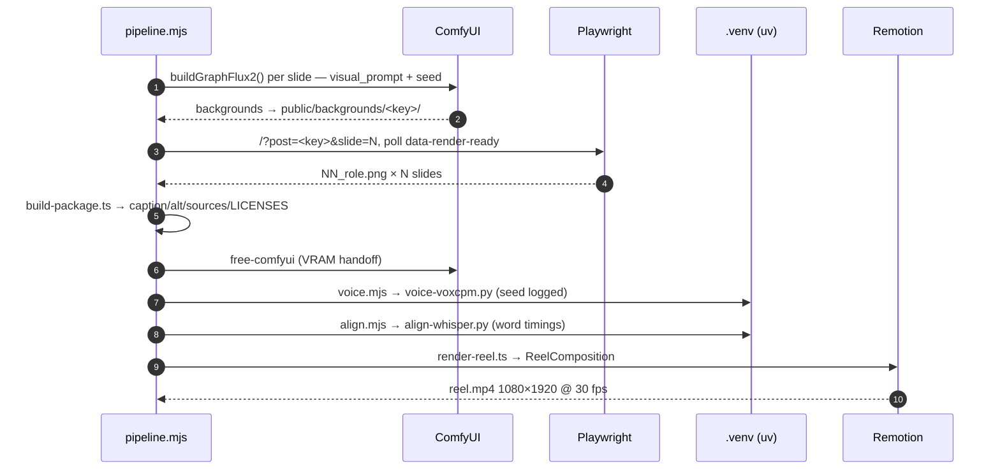

<div align="center">

# 🎬 renderer/

### The asset factory: approved post JSON → pixel-exact carousel PNGs + a narrated Reel

Bun · React · Tailwind · **Playwright** (1080×1350 carousel screenshots) · **Remotion** (1080×1920 @ 30 fps Reels) · **ComfyUI / FLUX.2 klein** (local slide art) · **VoxCPM2** (narration + voice cloning) · **Whisper** (word-synced captions)

[Quick start](#-quick-start) · [Pipeline stages](#-what-bun-run-pipeline-actually-does) · [Commands](#-command-reference) · [Flags](#-flag-reference) · [Architecture](#-architecture) · [Docs](#-docs-index)

</div>

---

**Optional and deletable by design.** This layer attaches at Stage 8 ("Assemble") of the 10-stage content workflow in [`../pipeline/content/CONTENT_PIPELINE.md`](../pipeline/content/CONTENT_PIPELINE.md). It turns an *approved* post JSON file into deterministic, upload-ready assets — delete it and manual Canva/Figma/CapCut assembly of the same approved content still works. It's an adapter, not a brain: nothing here invents claims.

## ⚡ Quick start

```bash
cd renderer
bun install
bunx playwright install chromium     # carousel screenshots
bunx remotion browser ensure         # reel rendering (once)

# ONE command — art → carousel → package → free GPU → voice → synced captions → reel:
bun run pipeline -- 2026-06-02_ai-phishing-training

# no local GPU? cloud art instead:
bun run pipeline -- 2026-06-02_ai-phishing-training --fal          # FAL.ai (needs FAL_KEY)
bun run pipeline -- 2026-06-02_ai-phishing-training --higgsfield   # Higgsfield (authed CLI by default)

# idea → researched + humanized JSON → rendered (skills + claude CLI):
bun run draft -- "AI agents leaking RAG data" model_security --theme=defensive

# live carousel preview:
bun run dev                          # http://localhost:4317
```

Output → `../pipeline/renders/<key>/`. **New to this? Start with [docs/RUN_IT_YOURSELF.md](docs/RUN_IT_YOURSELF.md)** — the full self-serve guide.

> **Gate:** only an **`approved`** post renders. Selecting a non-approved post stops the run with a fix-it message; approve first with `bun run status -- approved <key>`. A completed run flips the post to `generated` so re-runs skip finished work.

## 🔬 What `bun run pipeline` actually does

```
                         bun run pipeline -- <key>
                                   │
              ┌────────────────────┴──────────────────────┐
              │  gate: post JSON status must be approved  │
              └────────────────────┬──────────────────────┘
   ┌──────────┬──────────┬─────────┼──────────┬──────────┬──────────┐
   ▼          ▼          ▼         ▼          ▼          ▼          ▼
 1 ART      2 EXPORT   3 PACKAGE 4 FREE-GPU 5 VOICE    6 ALIGN    7 REEL
 ComfyUI    Playwright  caption/  unload     VoxCPM2    Whisper    Remotion
 FLUX.2     screenshots alt/      ComfyUI    narration  word-level composes
 per-slide  1080×1350   sources/  models     per beat   caption    scenes +
 prompts    per slide   LICENSES  (8 GB      (seeded,   timing     audio +
 (or --fal/             /QA files VRAM       cloneable)            captions →
 --higgsfield)                    handoff)                         reel.mp4
```

Each stage auto-skips when not needed (art if backgrounds already exist, voice if `voice_mode=none`, the GPU handoff entirely when art is cloud-generated). The hard constraint shaping this design: on **8 GB VRAM**, ComfyUI and VoxCPM2/Whisper can't coexist, so stage 4 unloads the image models before audio starts.



## 📖 Command reference

All commands run inside `renderer/` as `bun run <script> -- <args>`.

### Create & validate

| Command | Does |
| --- | --- |
| `new -- <date> <slug> <pillar>` | Scaffold a blank post JSON. `--slides=N` (3–20, default 8), `--theme=`, `--captions=`. Slide count is fixed at creation. |
| `draft -- "<idea>" <pillar>` | Idea → researched, humanized, schema-valid JSON → rendered. One post, end to end (needs the `claude` CLI). |
| `draft-week -- "idea::pillar" …` | Batch up to 5 with pillar variety + a posting calendar. |
| `draft-context [N]` | Variety digest of recent posts (overused hooks/motifs/angles) so the next post stays distinct. |
| `validate -- <key>` | Check the JSON against the Zod schema + content lint. |
| `status -- <status> <key>` | Set lifecycle status (`draft` → `approved` → `generated` → `upload_ready`). |

### Render

| Command | Does |
| --- | --- |
| `pipeline -- <key> [<key> …]` | The one-command orchestrator (all 7 stages, multi-post batch, `--status=approved` to batch by lifecycle). |
| `art -- <key>` | Slide backgrounds via a running ComfyUI — FLUX.2 klein 4B GGUF by default, cover included. `--only=N` for one slide, `--compare` for a non-destructive A/B. |
| `art:fal` / `art:higgsfield` / `art:diffusers` | Cloud art (FAL.ai / Higgsfield CLI-REST-MCP) or the legacy in-process diffusers path. |
| `higgsfield:models` | List Higgsfield models + per-image credit cost. |
| `upscale -- <key>` | Standalone GAN upscale pass on existing backgrounds. |
| `import-bg -- <key>` | Adopt an external PNG folder as a post's backgrounds. |
| `free-comfyui` | Unload ComfyUI's models (the art → voice GPU handoff). |
| `export -- <key>` | Playwright screenshots — one 1080×1350 PNG per slide. |
| `package -- <key>` | Write the upload bundle: caption, alt text, sources, LICENSES, QA checklist, IG upload checklist. |
| `voice -- <key>` | Narration audio. VoxCPM2 2B default; `--seed=N` makes the speaker reproducible (logged to `voice.meta.json`). |
| `align -- <key>` | Whisper word-level caption sync. |
| `reel -- <key>` | Remotion reel with audio auto-embedded. `reel:fal` / `reel:higgsfield` add per-beat image-to-video motion. |

### Publish & develop

| Command | Does |
| --- | --- |
| `publish -- <key> --platforms=…` | Gated multi-platform publish (YouTube/TikTok/Facebook/Instagram). `--dry-run`, `--force` (re-publish only, never bypasses the gate), `--yes`. |
| `publish:auth youtube\|tiktok\|meta` | One-time loopback OAuth per platform → gitignored tokens in `.secrets/`. `meta` covers Facebook **and** Instagram. |
| `dev` / `build` / `preview` | Vite dev server (`:4317`) / production build / preview. |
| `remotion:studio` | Remotion Studio for interactive reel debugging. |
| `test` / `test:smoke` | Bun test runner / Playwright fit-smoke test. |
| `typecheck` / `lint` / `lint:fix` | `tsc --noEmit` (app + Remotion tsconfigs) / Biome. |

## 🎛️ Flag reference

<details>
<summary><b>Art</b> (default: local ComfyUI, FLUX.2 klein 4B GGUF)</summary>

| Flag | Effect |
| --- | --- |
| `--flux1` | Legacy FLUX.1-schnell Q4 GGUF instead of FLUX.2 klein. |
| `--fal` / `--higgsfield` | Cloud backgrounds (FAL.ai needs `FAL_KEY`; Higgsfield defaults to the authed CLI). |
| `--higgsfield-mode=cli\|rest\|mcp` | Higgsfield transport (`rest` needs `HIGGSFIELD_API_KEY`+`SECRET`). |
| `--higgsfield-model=` / `--fal-model=` | Pick the cloud image model (Higgsfield defaults to FLUX.2 — prompts are FLUX-tuned; Soul hallucinates text). |
| `--budget=N` | Higgsfield credit cap per post (default 20; aborts expensive runs unless `--yes`). |
| `--passes=N` | Sampling steps, opt-in quality knob (rec 4–8, hard max 12 — klein is distilled). |
| `--q6` | Higher-quality Q6_K GGUF (auto-downloads). |
| `--upscale` | GAN upscale integrated into the art graph (`--upscale-model=`, `--upscale-scale=`). |
| `--ui-format` | Execute the version-controlled workflow FILE from [`comfyui-workflows/`](comfyui-workflows/) instead of the code-built graph. |
| `--cooldown=<sec>` | Pause between generations (default 25 s — thermal/CPU-watchdog protection; `0` disables). |
</details>

<details>
<summary><b>Voice</b> (default: VoxCPM2 2B; every post narrates unless told otherwise)</summary>

| Flag | Effect |
| --- | --- |
| `--voice=voxcpm2\|voxcpm2-0.5b\|bark\|http\|none` | Engine (`--vox2` / `--vox0.5` are aliases). `http` = any OpenAI-compatible `/v1/audio/speech` server via `TTS_BASE_URL`. |
| `--custom-voice path.wav` | Zero-shot clone of YOUR authorized voice (clean ~20–40 s mono clip). **On by default** if a reference clip exists (`$VOICE_REF` → `public/audio/_voiceref/jon.wav`). |
| `--custom-voice-text "…"` | Override the auto-Whisper transcript for hi-fi cloning (or a sidecar `<clip>.txt`). |
| `--no-hifi` / `--no-clone` | Timbre-only cloning / plain seeded voice. |
| `--seed=N` | Locks the speaker; same seed = same voice; logged to `voice.meta.json`. |

⚠️ Never ship F5-TTS base weights commercially (CC-BY-NC). LM Studio has no TTS endpoint — use VoxCPM2 or an HTTP TTS server.
</details>

<details>
<summary><b>Reel & captions</b></summary>

| Flag | Effect |
| --- | --- |
| `--captions=block\|word\|highlight` | Subtitle style. **Default `highlight`** (spoken word lit in a full line); `block` = rolling 2–3-word window; `word` = one at a time. |
| `--motion=local\|higgsfield\|fal` | Reel motion. Default `local` (Remotion animates stills); cloud modes animate the backgrounds into per-beat i2v clips. |
| `--motion-model=` / `--motion-budget=N` | Cloud motion model + separate credit cap (default 60; ≈7.5 cr/clip, 22 for veo-3.1). |
</details>

<details>
<summary><b>Pipeline-level</b></summary>

| Flag | Effect |
| --- | --- |
| `--status=approved` | Batch: render every post whose JSON status matches. |
| `--dry-run` | Preview the run, change nothing. |
| `--publish=youtube,tiktok,…` | Opt-in final stage: hand off to the gated publisher. |
| `--art` / `--no-art` / `--no-voice` / `--no-reel` | Force or skip stages. |
</details>

## 🏗️ Architecture

```
content/posts/<key>.json  ──►  Zod schema (src/lib/schema.ts)
        │
        ▼
┌─ src/ ──────────────────────────────────────────────────────┐
│ design/tokens.ts   palette, per-pillar accents, canvas      │
│                    geometry, type scale, safe zones         │
│ components/carousel/  one React component per slide role    │
│ lib/               post loader, caption-export, content     │
│                    checks (each with a paired test)         │
│ App.tsx            query-param router (?post=&slide=), sets │
│                    data-render-ready=1 after fonts+images   │
│                    +2 RAFs — Playwright polls for it        │
└─────────────────────────────────────────────────────────────┘
        │                                    │
        ▼                                    ▼
┌─ scripts/ ──────────────────┐   ┌─ remotion/ ─────────────────┐
│ every CLI entrypoint        │   │ ReelComposition.tsx         │
│ scripts/publish/adapters/   │   │  Scene · CaptionLayer ·     │
│  youtube · tiktok ·         │   │  CaptionTrack · AudioBed ·  │
│  facebook · instagram       │   │  EndCard                    │
│ scripts/lib/  shared helpers│   │                             │
└─────────────────────────────┘   └─────────────────────────────┘

```

**Key directories:** `content/posts/` (the post JSON files — schema documented in [docs/CONTENT_SCHEMA.md](docs/CONTENT_SCHEMA.md) and the root README's ERD) · `public/` (`audio/<key>/`, `backgrounds/<key>/`, `video/<key>/`, `walls/` theme pairs) · [`comfyui-workflows/`](comfyui-workflows/README.md) (version-controlled ComfyUI graphs for `--ui-format`) · [`scripts/`](scripts/README.md) + [`scripts/lib/`](scripts/lib/README.md) (CLI layer) · `docs/` (15 architecture/how-to docs, indexed below).

**Image-prompt doctrine:** each slide's `visual_prompt` is the *literal* string FLUX.2 klein receives (no prompt upsampler). Author it per [`../pipeline/content/VISUAL_PROMPT_BANK.md`](../pipeline/content/VISUAL_PROMPT_BANK.md): prose, `Subject + Action + Style + Context`, lighting-first, theme-driven accent, no hardcoded colour, text-free zones phrased positively.

## 🧪 Tests

`bun test` covers art prompt composition, the FAL/Higgsfield API clients, post scaffolding, all four publish adapters, OAuth/Meta auth, publish state/idempotency, schema validation, fit-to-frame math, caption export, and content QA checks. `bun run test:smoke` is a Playwright fit-smoke test against the live carousel app.

## ⚠️ Gotchas

- **Render hangs at startup** → a stale dev server holds port 4317; kill it.
- **First reel** → run `bunx remotion browser ensure` once. The `zod version mismatch` warning is harmless (we pin zod v3 for the schema and don't use Remotion's zod feature).
- **`node_modules/` is not committed** → `bun install`. Bun only, never npm.
- **GPU thermals** → the art loop pauses 25 s between images by default; the real fix is power-limiting/undervolting (see [docs/IMAGE_MODELS.md](docs/IMAGE_MODELS.md)).
- **Licensing is a real gate** → every shipped asset is logged per render in `LICENSES.md`; VoxCPM2/FLUX weights are Apache-2.0, F5-TTS base weights are banned (CC-BY-NC).

## 📚 Docs index

| Doc | What |
| --- | --- |
| [docs/RUN_IT_YOURSELF.md](docs/RUN_IT_YOURSELF.md) | **Start here** — self-serve terminal guide: new reels/carousels, troubleshooting |
| [docs/PROJECT_ARCHITECTURE.md](docs/PROJECT_ARCHITECTURE.md) | Whole-system view — layers, post-JSON model, GPU boundaries |
| [docs/DRAFT_PIPELINE_ARCHITECTURE.md](docs/DRAFT_PIPELINE_ARCHITECTURE.md) | Idea → post JSON (the drafting side) |
| [docs/PIPELINE_ARCHITECTURE.md](docs/PIPELINE_ARCHITECTURE.md) | Post JSON → render (the 7 stages, sequence diagrams) |
| [docs/PUBLISHING_ARCHITECTURE.md](docs/PUBLISHING_ARCHITECTURE.md) | The gated multi-platform publisher |
| [docs/IMAGE_MODELS.md](docs/IMAGE_MODELS.md) | Art engines: local FLUX matrix, cloud `--fal`/`--higgsfield`, quality knobs |
| [docs/CONTENT_SCHEMA.md](docs/CONTENT_SCHEMA.md) | The JSON contract + filename conventions |
| [docs/CAROUSEL_COMPONENTS.md](docs/CAROUSEL_COMPONENTS.md) | Slide-role components + shared shell |
| [docs/PLAYWRIGHT_EXPORT_WORKFLOW.md](docs/PLAYWRIGHT_EXPORT_WORKFLOW.md) | Screenshot export + validation |
| [docs/REMOTION_REEL_WORKFLOW.md](docs/REMOTION_REEL_WORKFLOW.md) | Reel composition + adding narration |
| [docs/DESIGN_SYSTEM.md](docs/DESIGN_SYSTEM.md) | Tokens, accents, type scale |
| [../docs/publishing/PUBLISHING.md](../docs/publishing/PUBLISHING.md) | Publisher setup, auth, platform audits |

## 🔒 Guardrails

Same trust standard as the whole repo (see the [root README](../README.md#-non-negotiables-the-trust-standard)): no fabricated facts (claims triangulated + tagged), copy reads human via the `humanizer → stop-slop → professional-proofreader` chain, backgrounds are text-free/logo-free/credential-free, every shipped asset is commercial-licensed, and a human approval gate stays in front of every post. Nothing auto-posts a draft.
