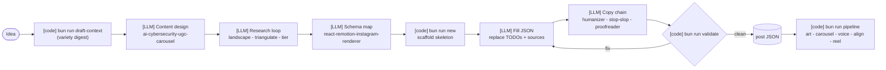
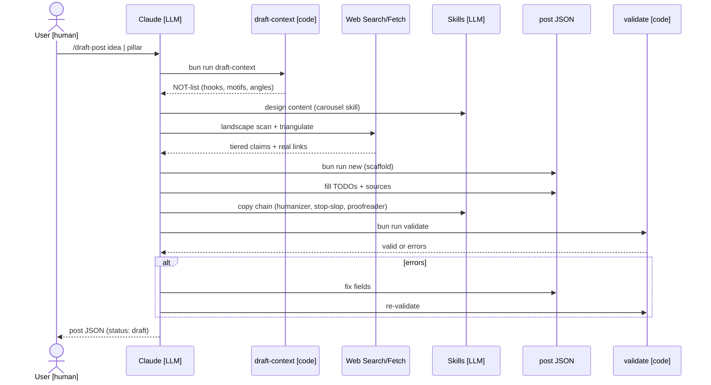
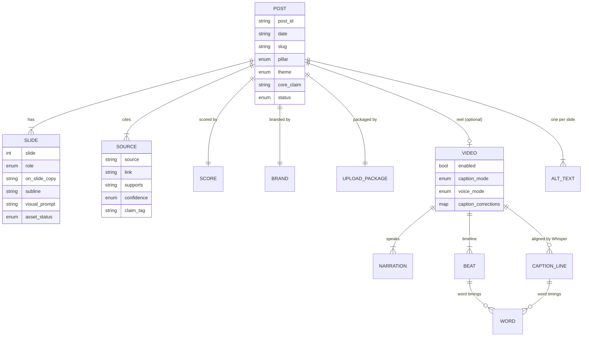
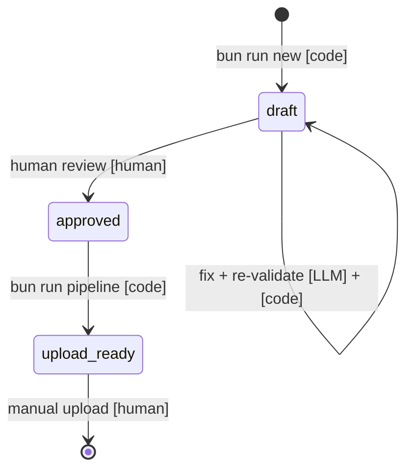

# DRAFT_PIPELINE_ARCHITECTURE.md — the pre-render "Assemble" stage

How an **idea** becomes an **approved, schema-valid post JSON**, before a single pixel is rendered. This is the front half of the system. The back half (JSON → backgrounds → carousel → voice → reel) lives in **`PIPELINE_ARCHITECTURE.md`**; the two meet at one artifact: `renderer/content/posts/<date>_<slug>.json`.

```
            ┌─────────────────────────  DRAFT (this doc)  ─────────────────────────┐
 idea  ──▶  variety digest ─▶ content design ─▶ research loop ─▶ schema map ─▶ scaffold+fill ─▶ copy chain ─▶ validate
            (draft-context)   (carousel skill)  (web, tiered)   (renderer skill) (bun run new)  (3 skills)   (bun run validate)
                                                                                                                   │
                                                                                                                   ▼
            ┌──────────────────────────  RENDER (PIPELINE_ARCHITECTURE.md)  ─────────────────────────────────────┐
            post JSON ─▶ art (FLUX.2) ─▶ carousel PNGs ─▶ package ─▶ voice (VoxCPM2) ─▶ align (Whisper) ─▶ reel.mp4
```

**Who does each step:** `[code]` (a deterministic script, no LLM) = `draft-context`, `bun run new`, `validate`, `pipeline`. `[LLM]` (the agent) = content design, the research loop, filling the JSON with real copy + sources, and the copy chain. `[human]` = approval and the manual upload. The diagrams below carry these tags. (So "Fill JSON / replace TODOs + sources" is `[LLM]` — the scaffolder only writes empty TODOs and a placeholder source.)

Positioning rule for everything below: **real threats, real tools, no fake panic.** Sourced or `[Scenario]`, a concrete defender takeaway, human approval before posting.

---

## Diagrams

> **Legend:** `[LLM]` = the agent (Claude) does this step · `[code]` = a deterministic script · `[human]` = you.

### Flow: idea to validated JSON (and the hand-off to render)



### Sequence: what `/draft-post` actually does



### Schema (ERD): the post JSON the draft stage produces

*The `[LLM]` agent fills these fields; `validate.ts` `[code]` enforces the invariants (slide numbering, `alt_text` length = slide count, `score.total` = sum of axes).*



### Status lifecycle



---

## Entry points

| How | Command | Notes |
|---|---|---|
| Interactive, one post | `/draft-post <idea> \| <pillar> [\| key=value …]` | `.claude/commands/draft-post.md`. Claude drives the whole stage. |
| Interactive, a week | `/draft-week idea::pillar \| …` | up to 5, pillar variety + calendar. `.claude/commands/draft-week.md`. |
| Headless, one post | `cd renderer && bun run draft -- "<idea>" <pillar> [flags]` | `scripts/draft.mjs` shells the `claude` CLI with the same prompt. |
| Headless, a week | `bun run draft-week -- "idea::pillar" …` | `scripts/draft-week.mjs`. |
| Manual skeleton only | `bun run new -- <date> <slug> <pillar> [--slides=N] [--theme=] [--captions=] [--voice=] [--music=]` | `scripts/new-post.ts`. Writes a valid TODO skeleton; you fill it by hand. |
| Variety digest (read-only) | `bun run draft-context [N]` | `scripts/draft-reference.mjs`. Prints the NOT-list (see below). |

All paths converge on the same JSON shape (`renderer/src/lib/schema.ts`, Zod).

---

## The stages

### 0. Variety digest (run first, every time)
`bun run draft-context` scans the most recent posts and prints a **NOT-list** so the new post does not blur into the last ten:
- **Overused cover-hook openers** — rotate the hook formula (contradiction, command, number/stat, named scenario, blunt question, myth flip).
- **Overused visual motifs** — the concrete objects recent `visual_prompt`s lean on (e.g. padlock, key, envelope, mask). Pick fresh ones.
- **Defender-takeaway ANGLE coverage** — which angles keep repeating (⚠ flagged when used in ≥40% of recent posts) and which are unused. *Not every AI-tool post is "indirect prompt injection / it's unsafe."* Rotate among: data exfiltration, credential/token scope, supply-chain trust, cost/resource abuse, identity/auth, autonomy/blast radius, auditability, governance/approval, detection, myth-bust.

The interactive commands tell Claude to read this; the headless `draft.mjs` / `draft-week.mjs` **inject the digest straight into the prompt**.

### 1. Load the brand brain
Read `pipeline/content/BRAND_BRAIN.md` (positioning, voice pointers, theme logic, story) so hook, angle, theme, and CTA all pull from one source.

### 2. Content design — skill `ai-cybersecurity-ugc-carousel`
Designs the defensible cover hook, the slide arc (default 8: cover, context, risk, mechanism, failure_point, defense, takeaway, cta; with `slides=N`, cover first + cta last + takeaway at N−1, middle from named roles then generic `point` slides), the caption, the bracketed topic list (stored in `hashtags`, rendered `[topic, …]`), and the comment question — in the house voice (`pipeline/content/VOICE_AND_TONE_GUIDE.md`).

### 3. Research loop (not one search)
1. **Landscape scan** — broad WebSearch to map the claim space *and the counter-arguments*.
2. **Gather primaries** — WebFetch OWASP / NCSC / NIST / CISA / CVE-NVD / vendor security blogs / named journalism / official repos + model cards.
3. **Triangulate** — ≥2 independent reputable sources for any load-bearing claim.
4. **Confidence-tier** each claim → `[Verified]` (≥2 agree) · `[Emerging]` (one reputable / weak) · `[Scenario]` (illustrative, labelled in-copy). Record `{source, link, supports, confidence, claim_tag}` into `sources[]`.
- **Hard gates:** no fabricated URLs; re-open every link the same day; disclose empty angles; never name a real victim without a cited public source. Big/uncertain topic → optionally invoke the `deep-research` skill.

### 4. Map to schema — skill `react-remotion-instagram-renderer`
Choose `theme` (offensive/defensive/hacking/purple-team/ai), a kebab `slug`, and write a **specific, distinct, theme-agnostic `visual_prompt` for every slide**: one concrete physical object doing something physical, dark cinematic, no colour words, no UI/text/logo nouns, and **not** a motif the digest flagged as overused. Accent-mark the takeaway `on_slide_copy`: affirmative in `[[…]]` (theme accent), negation in `{{…}}` (danger red, which falls back to muted slate on red themes so it isn't red-on-red).

### 5. Scaffold, then fill
`bun run new …` writes the skeleton; then **Edit** the JSON replacing every `TODO` with real, sourced content. Schema invariants: N slides (slide 1 = cover, last = cta), `alt_text` length = slide count, `score.total` = sum of the five axes, ≥1 real source, reel `beats` filled, `video.caption_mode` / `video.audio.voice_mode` match the flags.

### 6. Copy chain (order matters)
`humanizer` → `stop-slop` → `professional-proofreader`, run over `caption`, `video.narration[]`, every `on_slide_copy` + `subline`, and `alt_text[]`:
- **humanizer** — house voice (`.claude/skills/humanizer/references/voice-profile.md`); strip AI tells.
- **stop-slop** — cut filler / throat-clearing / AI jargon / "not just X but Y" / vague declarations; score directness/rhythm/trust/authenticity/density (revise < 35/50).
- **professional-proofreader** — grammar/spelling/punctuation; every line a complete spoken sentence with substance.
- **Hard, every surface:** NO em-dashes (`—`/`–`), NO sentence fragments. Never alter a sourced fact, number, or `claim_tag` for style.

If narration must spell a name phonetically for the TTS (e.g. "Nous" → "Noo"), add a per-post `video.caption_corrections` map (`{"new":"Nous"}`) so `bun run align` restores the display spelling in the reel subtitle.

### 7. Validate → hand off
`bun run validate -- <date>_<slug>` until clean. Set `status` to `approved` only when confident; otherwise leave `draft`. The post is now ready for the **render pipeline** (`PIPELINE_ARCHITECTURE.md`) via `bun run pipeline -- <key>`.

---

## File map

| Concern | File |
|---|---|
| Interactive command specs | `.claude/commands/draft-post.md`, `.claude/commands/draft-week.md` |
| Headless drivers | `renderer/scripts/draft.mjs`, `renderer/scripts/draft-week.mjs` |
| Variety digest | `renderer/scripts/draft-reference.mjs` (`bun run draft-context`) |
| Skeleton scaffolder | `renderer/scripts/new-post.ts` (`bun run new`) |
| Schema (source of truth) | `renderer/src/lib/schema.ts` (Zod) · validator `renderer/scripts/validate.ts` |
| Content skills | `.claude/skills/ai-cybersecurity-ugc-carousel`, `react-remotion-instagram-renderer` |
| Copy-chain skills | `.claude/skills/humanizer`, `stop-slop`, `professional-proofreader` |
| Brand + voice | `pipeline/content/BRAND_BRAIN.md`, `VOICE_AND_TONE_GUIDE.md`, `DRAFT_POST_REFERENCE.md` |
| Rules gate | `pipeline/content/QA_CHECKLIST.md` |

## Flags (shared across the entry points)
`slides=3-20` (default 8) · `theme=offensive\|defensive\|hacking\|purple-team\|ai` · `captions=block\|word\|highlight` (default highlight) · `voice=none\|voxcpm2\|voxcpm2-0.5b\|bark\|http\|file` (default voxcpm2) · `music=none\|free\|licensed\|generated\|file`. See `DRAFT_POST_REFERENCE.md` for the full cheat-sheet.
