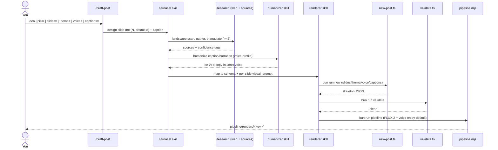
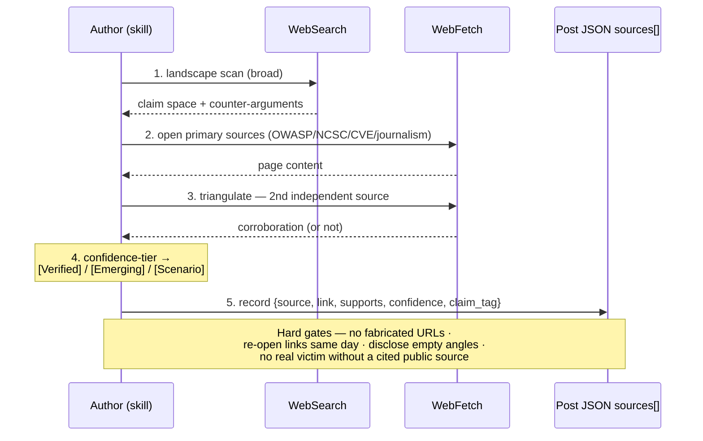
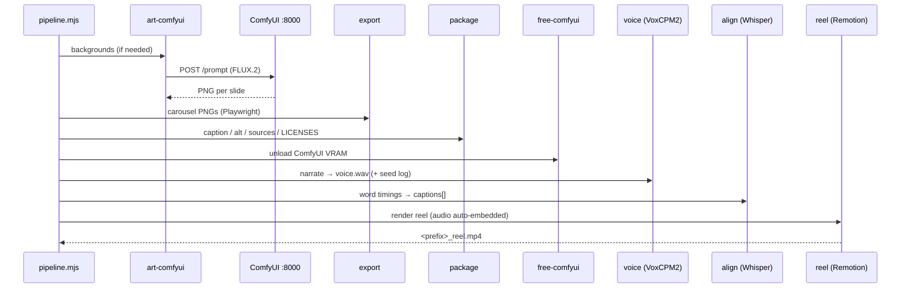
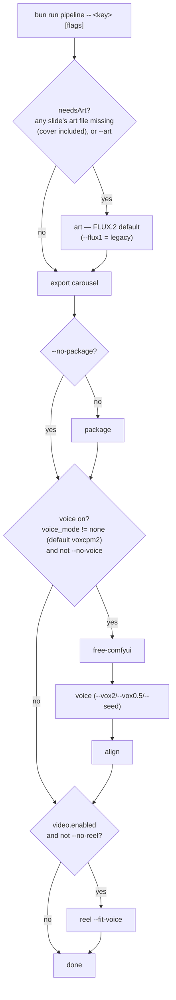

# Pipeline Architecture

The content-to-render pipeline, end to end: how a sourced idea becomes a validated post JSON and then a carousel + reel. For the system-wide view (layers, data model, GPU boundaries) see [PROJECT_ARCHITECTURE.md](./PROJECT_ARCHITECTURE.md).

There are two entry points. **`/draft-post`** (and `/draft-week`) takes an *idea* and does everything — research, write, scaffold, validate, render. **`bun run pipeline`** is the render-only engine you call when the JSON already exists (you hand-edited it, or you're re-rendering).

---

## 1. `/draft-post` — idea to rendered post

The slash command (or the headless `bun run draft`) orchestrates both skills. Research and a humanize pass happen *before* the JSON is finalized, so the copy is sourced and reads like a person, not a model. The `theme=` option sets the brand colour — `offensive` (red), `defensive` (blue), `hacking` (green), `purple-team` (purple), or `ai` (generic AI, orange).

---

## 2. The expanded research step

Research is no longer "search once, paste a link." It runs a small, source-grounded loop adapted from deep-research practice (tiering + triangulation + hard gates), mapped onto the project's existing claim tags. The goal: load-bearing claims are backed by **two independent sources**, and anything thinner is honestly tagged down.

**Tag mapping:** `[Verified]` = ≥2 independent reputable sources agree · `[Emerging]` = one reputable source, or weaker corroboration · `[Scenario]` = illustrative, no confirming source (must be labelled in-copy). Confidence (`high/medium/low`) is recorded per source in `sources[]`.

---

## 3. `bun run pipeline` — the render engine

One command runs seven steps in order. It keeps one GPU model resident at a time (art on ComfyUI, then `free-comfyui`, then VoxCPM/Whisper), and the reel auto-embeds the generated voice.

### The seven steps

| # | Step | Script | In → Out | Skips when |
|---|------|--------|----------|-----------|
| 1 | art | `art-comfyui.mjs` | each needy slide's `visual_prompt` → background PNG (ComfyUI, **FLUX.2 default**, **cover included**) | every slide's art file already exists on disk (or `asset_status: existing`) and no `--art` |
| 2 | export | `export-carousel.ts` | JSON + React → 1080×1350 PNGs | — |
| 3 | package | `build-package.ts` | JSON → `caption.txt`, `alt_text.txt`, `sources.md`, `LICENSES.md` | `--no-package` |
| 4 | free-comfyui | `free-comfyui.mjs` | ComfyUI `/free` → VRAM released | non-fatal if ComfyUI is down |
| 5 | voice | `voice.mjs` → `voice-voxcpm.py` | `narration[]` → `voice.wav` (+ `voice.meta.json` seed) | `voice_mode=none` or `--no-voice` |
| 6 | align | `align.mjs` → `align-whisper.py` | `voice.wav` → `captions[]` word timings | runs with voice |
| 7 | reel | `render-reel.ts` | slides + captions + audio → `<prefix>_reel.mp4` | `--no-reel` or `video.enabled=false` |

### Skip / decision logic

---

## 4. Flags reference

| Flag | Applies to | Effect |
|------|-----------|--------|
| `--flux1` | art | Opt into legacy FLUX.1-schnell. **FLUX.2-klein is the default** (no flag), and the cover is auto-generated. |
| `--art` / `--no-art` | art | Force regen / skip entirely. |
| `--vox2` / `--vox0.5` | voice | Override voice model for this run (VoxCPM2 2B / VoxCPM-0.5B) without editing the JSON. |
| `--seed=N` | voice | Lock the speaker. Same N = same voice. Logged to `voice.meta.json`. Omit → auto-rolled + logged. |
| `--no-voice` | voice/align | Silent reel. **Voice is on by default (VoxCPM2 2B)** — this is how you turn it off. |
| `--no-reel` | reel | Stop after carousel/package. |
| `--no-package` | package | Skip the upload-file assembly. |
| `--no-fit-voice` | reel | Don't trim/realign the reel to the voice length. |
| `--dry-run` | all | Print what would run. |

Multiple post keys → batch.

## 5. Failure modes

- **Render hangs at startup** → a stale dev server holds port 4317: `netstat -ano | grep :4317` → `taskkill //PID <pid> //F`, retry.
- **Reel errors on browser setup** → run `bunx remotion browser ensure` once.
- **VoxCPM `WinError 127`** → torch/torchaudio version mismatch; the trio is pinned together in `pyproject.toml` (`uv sync`).
- **Voice crawls at ~1–3%** → an unlucky seed produced a degenerate, non-terminating generation; pick a different `--seed`. (Seed `777` is known-bad and auto-avoided.)
- **Garbled fake text in backgrounds** → a `visual_prompt` used UI/abstract nouns; keep prompts to concrete physical objects (see [IMAGE_MODELS.md](./IMAGE_MODELS.md)).

## 6. Output

Everything lands in `pipeline/renders/<key>/`: eight carousel PNGs (`<prefix>_NN_role.png`), `<prefix>_reel.mp4`, `caption.txt`, `alt_text.txt`, `sources.md`, `LICENSES.md`, and `voice.meta.json` (reusable seed). A human reviews and uploads — no auto-publish.
