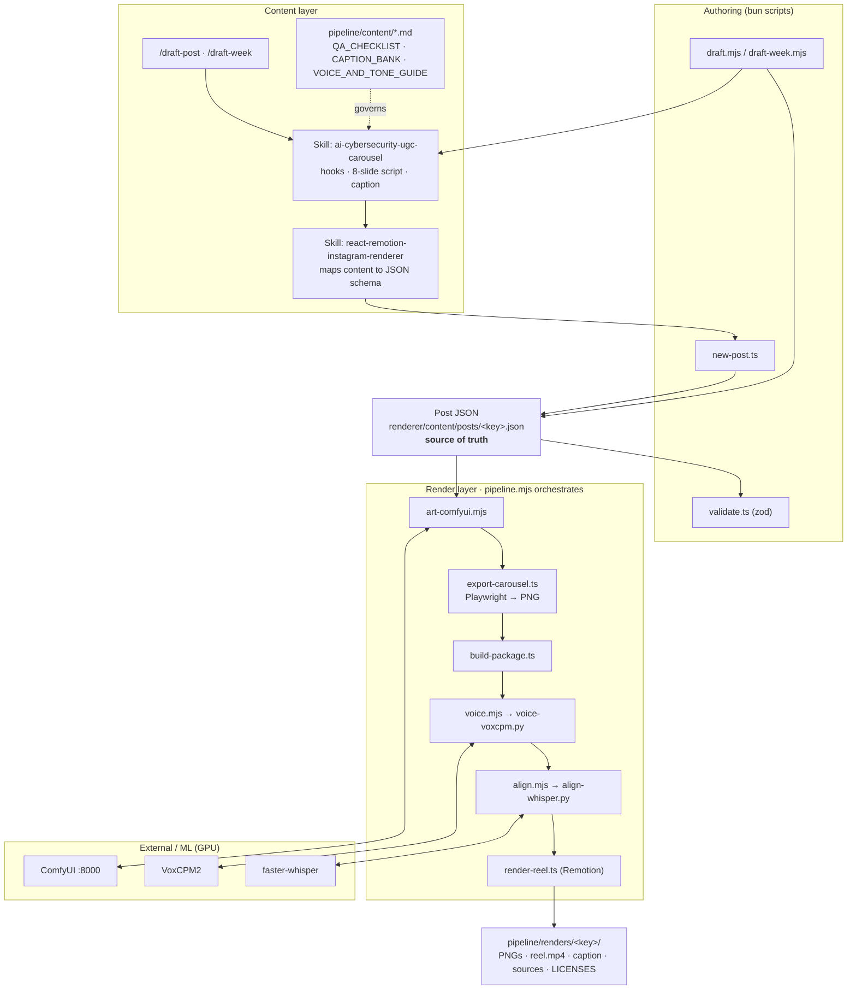
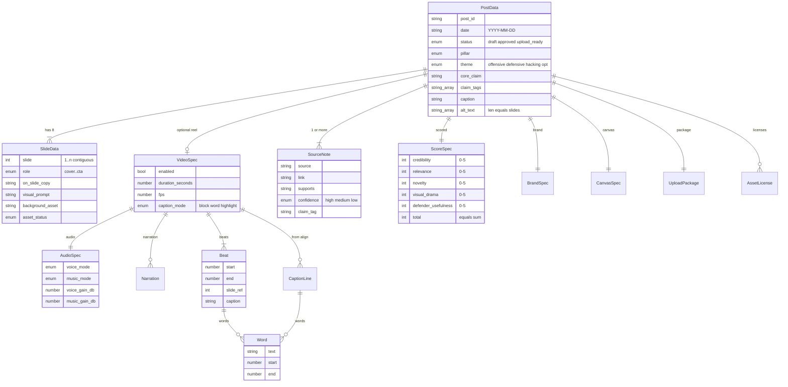
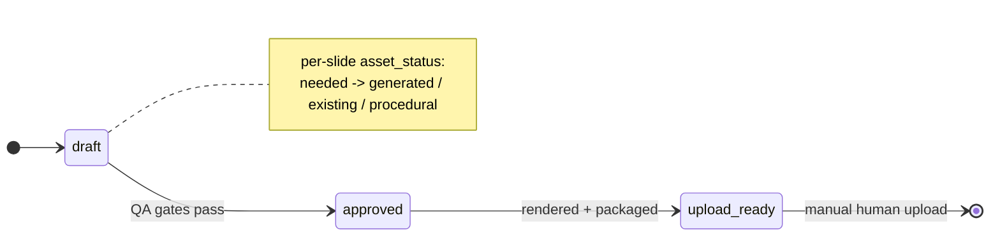
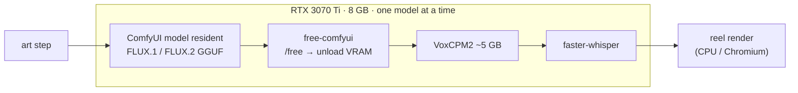

# Project Architecture

How the AI-in-cybersecurity UGC pipeline is put together — the layers, the one JSON file everything hangs off, and where the work actually runs. For the step-by-step render flow (research → art → reel), see [PIPELINE_ARCHITECTURE.md](./PIPELINE_ARCHITECTURE.md).

**Positioning:** real threats, real tools, no fake panic. The whole system exists to turn a sourced security claim into an Instagram carousel + reel, with a human approving before anything ships.

---

## 1. The big picture

Three layers sit on top of one source of truth. Content gets *designed* (skills + commands), *written into* a single post JSON, then *rendered* into upload-ready files. Nothing downstream invents claims — if it isn't in the JSON, it doesn't get drawn or spoken.



---

## 2. Repository layout (key files)

```
ai-ugc-pipeline/
├── CLAUDE.md                      project guide + non-negotiable rules
├── .claude/
│   ├── commands/                  /draft-post, /draft-week (slash commands)
│   └── skills/
│       ├── ai-cybersecurity-ugc-carousel/   writes the content
│       ├── react-remotion-instagram-renderer/  maps content → JSON
│       └── humanizer/             (vendored, MIT) de-AI + voice calibration
├── pipeline/
│   ├── content/                   workflow + voice + QA docs, idea backlog
│   │   ├── QA_CHECKLIST.md  CONTENT_PIPELINE.md  CAPTION_BANK.md
│   │   ├── VOICE_AND_TONE_GUIDE.md  DRAFT_POST_REFERENCE.md  WEEK_1_POSTS.md
│   ├── media/                     tool stack, voiceover/b-roll/music guides
│   └── renders/<key>/             upload-ready output packages
└── renderer/
    ├── content/posts/<key>.json   THE post (source of truth)
    ├── src/
    │   ├── lib/schema.ts           zod schema (validates every post)
    │   ├── design/tokens.ts        palette, themes, BRAND_STYLE, overlays
    │   └── components/carousel/    React carousel (Deck/Slide/Background)
    ├── remotion/                   reel composition (Scene, CaptionLayer, AudioBed)
    ├── scripts/                    the pipeline (see table below)
    ├── public/backgrounds|audio/   generated assets (gitignored)
    ├── docs/                       these architecture + how-to docs
    └── pyproject.toml              ML deps (VoxCPM, Whisper) — uv-managed .venv
```

---

## 3. Component inventory

| Component | File | Responsibility |
|---|---|---|
| **Schema / validation** | `renderer/src/lib/schema.ts` | The zod `PostData` schema — single contract; fails loud on bad/missing fields. |
| **Design tokens** | `renderer/src/design/tokens.ts` | `palette`, `pillarAccent`, 3-way `themes` (offensive/defensive/hacking), `BRAND_STYLE`, `overlays` (readability scrim). |
| **Carousel UI** | `renderer/src/components/carousel/*` | `CarouselDeck` → `CarouselSlide` (text + scrim) → `SlideBackground` (AI art + overlays); `slides.tsx` per-role renderers. |
| **Reel composition** | `renderer/remotion/*` | `ReelComposition` (1080×1920@30fps) → `Scene`, `CaptionLayer` (block/word/highlight), `CaptionTrack` (Whisper sync), `AudioBed` (voice+music, missing-file guard), `EndCard`. |
| **Scaffold** | `renderer/scripts/new-post.ts` | Create a schema-valid skeleton from flags (`--theme/--captions/--voice/--music`). |
| **Draft (headless)** | `renderer/scripts/draft.mjs`, `draft-week.mjs` | Drive the `claude` CLI + skills to research, fill, validate, render. |
| **Validate** | `renderer/scripts/validate.ts` | Parse a post against the schema (8 slides, alt_text length, score sum, ≥1 source). |
| **Art** | `renderer/scripts/art-comfyui.mjs` | Drive ComfyUI HTTP API; **FLUX.2-klein (default)** / FLUX.1-schnell (`--flux1`) GGUF graphs; per-slide prompts, cover included; disk-aware (skips slides whose art already exists). |
| **Export** | `renderer/scripts/export-carousel.ts` | Playwright → 1080×1350 carousel PNGs. |
| **Package** | `renderer/scripts/build-package.ts` | Assemble `caption.txt`, `alt_text.txt`, `sources.md`, `LICENSES.md`. |
| **Voice** | `renderer/scripts/voice.mjs` → `voice-voxcpm.py` / `voice-http.mjs` | TTS narration (**VoxCPM2 2B default, on for every post**; OpenAI-compatible server via `http`); logs a reusable seed. |
| **Align** | `renderer/scripts/align.mjs` → `align-whisper.py` | faster-whisper word-level caption timings. |
| **Reel** | `renderer/scripts/render-reel.ts` | Remotion render, audio auto-embedded. |
| **Orchestrator** | `renderer/scripts/pipeline.mjs` | One command: art → export → package → free-comfyui → voice → align → reel. |
| **GPU release** | `renderer/scripts/free-comfyui.mjs` | Unload ComfyUI's models so VoxCPM/Whisper get the 8 GB. |

---

## 4. The data model — one post JSON

Every post is a single JSON validated by `PostData` in `schema.ts`. It carries the content, the carousel slides, the reel spec, the sources, the QA flags, and the upload manifest. The renderer reads it; it never adds claims.



**Enforced invariants** (`schema.ts` `superRefine`): slide numbers are contiguous `1..n`; slide 1 is the `cover`; `alt_text.length === slides.length`; `score.total` equals the sum of the five axes; at least one source. The 8 slide roles are fixed: `cover, context, risk, mechanism, failure_point, defense, takeaway, cta`.

---

## 5. Lifecycle

A post moves `draft → approved → upload_ready`, and a human does the final upload — there's no auto-publish. Each slide independently tracks whether its background art is needed, generated, supplied, or just procedural CSS.



---

## 6. Runtime & process boundaries (8 GB, one model at a time)

The hard constraint: an RTX 3070 Ti has **8 GB of VRAM**, and the diffusion model (ComfyUI) and the speech models (VoxCPM2, Whisper) can't all live there at once. So the pipeline keeps **one big model resident at a time** — it generates all the art through the persistent ComfyUI server, then calls `free-comfyui` to unload it before voice/align take the GPU. The carousel export and reel render are CPU/Chromium work and don't fight for VRAM.



**External systems:** ComfyUI runs as a persistent HTTP server on `127.0.0.1:8000` (its own env at `E:\ComfyUI`); VoxCPM2 + faster-whisper run in the renderer's own `uv` venv (`renderer/.venv`, Python 3.12); the optional `http` voice mode hits an OpenAI-compatible `/v1/audio/speech` server (e.g. Kokoro-FastAPI). Image gen, TTS, and alignment all run locally — no required cloud AI.

## 7. Tech stack

- **Authoring/render:** Bun + TypeScript, React (carousel), Playwright (PNG export), Remotion (reel), zod (schema).
- **Image gen:** ComfyUI + ComfyUI-GGUF — **FLUX.2-klein 4B (Q5, default)** / FLUX.1-schnell (Q4, `--flux1`). See [IMAGE_MODELS.md](./IMAGE_MODELS.md).
- **Speech:** VoxCPM2 (Apache-2.0) for TTS; faster-whisper for word alignment. torch/torchaudio/torchvision pinned together (CUDA index) in `pyproject.toml`.
- **Content/QA:** house docs in `pipeline/content/` (voice, QA gates, idea backlog), enforced by the two skills + the slash commands.
