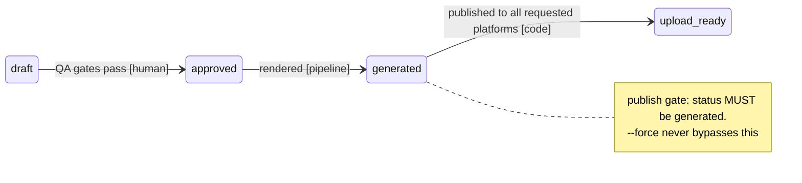
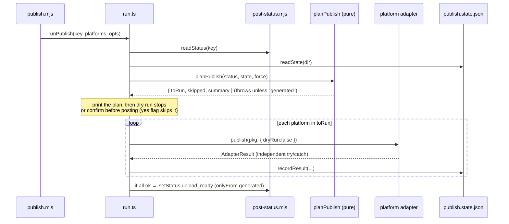

# Publishing Architecture

How a rendered post's `reel.mp4` gets published to **YouTube Shorts**, **TikTok**, a **Facebook Page**, and **Instagram** (Reels) — gated, idempotent, single-operator. Instagram can also run in a manual-checklist mode (`instagram.mode: "manual"`, still the default) for content this Reels-only adapter doesn't cover, e.g. carousels. For the system-wide view see [PROJECT_ARCHITECTURE.md](./PROJECT_ARCHITECTURE.md); for the render engine that produces the reel see [PIPELINE_ARCHITECTURE.md](./PIPELINE_ARCHITECTURE.md); for operator setup (create the apps, env, auth, audits) see [../../docs/publishing/PUBLISHING.md](../../docs/publishing/PUBLISHING.md).

**Positioning:** a human approves before anything ships. Publishing never runs silently and never posts a `draft`.

---

## 1. The adapter contract

Every platform implements one small interface (`renderer/scripts/publish/types.ts`), so the orchestrator treats YouTube, TikTok, and Instagram uniformly.

```ts
RenderPackage  { key, dir, reelPath, post: { post_id, caption, hashtags, … } }
AdapterResult  { platform, kind: "api"|"manual", status: "published"|"manual"|"failed", id?, url?, privacy?, message?, error? }
PlatformAdapter{ name, kind, publish(pkg, { dryRun }): Promise<AdapterResult> }
```

Adapters are built by **dependency-injection factories** (`makeYoutubeAdapter(deps)`, `makeTiktokAdapter(deps)`, `makeFacebookAdapter(deps)`, `makeInstagramAdapter(deps)`) whose deps wrap config, token minting, `fetch`, and file reads. That lets every adapter be **fixture-tested with no live credentials** — the network is injected. The default exports (`youtubeAdapter`, `tiktokAdapter`, `facebookAdapter`, `instagramAdapter`) wire the real implementations.

---

## 2. Component inventory

| Component | File | Responsibility |
|---|---|---|
| **Adapter contract** | `publish/types.ts` | `RenderPackage`, `AdapterResult`, `PlatformAdapter` interface. |
| **Config** | `publish/config.ts` | Load + zod-validate `publish.config.json` (per-platform enabled/privacy/interaction). |
| **Metadata mapper** | `publish/metadata.ts` | Pure post → per-platform payload (YouTube `snippet`/`status`, TikTok `post_info`); title truncation, hashtags, `#Shorts`. |
| **Publish state** | `publish/state.ts` | Read/write `pipeline/renders/<key>/publish.state.json`; `shouldSkip()` idempotency. |
| **OAuth / token** | `publish/auth/oauth.ts` | `getAccessToken(platform)` — reads the stored token, refreshes if stale (<60 s), persists. Pure `accessTokenIsFresh` / `mergeToken`. YouTube + TikTok only. |
| **Auth config** | `publish/auth/youtube.ts`, `tiktok.ts` | Per-platform token endpoint, scopes, refresh-body builder. |
| **Meta token lifecycle** | `publish/auth/meta.ts` | `getMetaCredentials()` — a distinct lifecycle from `oauth.ts`: long-lived token exchange, `/me/accounts` resolution, `/debug_token` liveness check (no refresh_token rotation for Page tokens). |
| **Auth CLI** | `publish/auth/cli.mjs` | `bun run publish:auth <platform>` — one-time interactive OAuth (loopback `:8788`). `meta` writes `.secrets/meta.json` instead of a refresh-token store. |
| **YouTube adapter** | `publish/adapters/youtube.ts` | `videos.insert` via the raw **resumable REST** flow (init session → PUT bytes). |
| **TikTok adapter** | `publish/adapters/tiktok.ts` | Direct Post: `creator_info` → privacy → `video/init` → PUT chunk → poll status. |
| **Facebook adapter** | `publish/adapters/facebook.ts` | Page video resumable upload: `upload_phase` start → transfer (single chunk) → finish; `published=false` by default. |
| **Instagram adapter** | `publish/adapters/instagram.ts` | `mode: "api"` — `postType: "reels"` (default) or `"carousel"` (children + parent container from every slide PNG), both via the temp-hosting pre-step, then poll `status_code` → `media_publish`. Always sets `is_ai_generated=true` (parent only, for carousels); adds `trial_params` when `trialReels` is enabled. `mode: "manual"` (default) returns a paste-ready checklist; no network. |
| **Temp hosting** | `publish/adapters/lib/temp-hosting.ts` | Uploads the reel to `website/api/publish-temp.ts` (Vercel Blob on `ai-ugc.chron0.tech`) for Instagram's public `video_url` fetch, then deletes it via `publish-temp-delete.ts`. |
| **Orchestrator** | `publish/run.ts` | `planPublish()` (pure gate/skip decision) + `runPublish()` (resolve → plan → run adapters → record → flip status). |
| **CLI entry** | `publish.mjs` | Thin argv parser → `runPublish` (`--platforms --dry-run --force --yes`). |
| **Fixtures** | `publish/fixtures/*.json` | Canned API responses for the adapter tests. |

---

## 3. The gate and lifecycle

Publishing is the terminal transition of the post lifecycle `draft → approved → generated → upload_ready`.

- **Only a `generated` post may publish.** `generated` means *approved AND rendered* (`bun run pipeline` flips `approved → generated` after a successful render), so it is the only status that actually has a reel on disk. `draft` and unrendered `approved` are rejected by `planPublish()` with a "render it first" message.
- **`--force` does not bypass the gate.** It only re-publishes a platform already marked `published` in state; it never lifts the `generated` requirement.
- On success across every requested platform, the post flips **`generated → upload_ready`** (`setStatus(key, "upload_ready", { onlyFrom: ["generated"] })`). A partial failure leaves the status untouched so a re-run can finish the rest.



---

## 4. OAuth / token lifecycle

One-time, local, single-operator. Tokens live in gitignored `renderer/.secrets/<platform>.json`.

- **`publish:auth`** starts a loopback server on `http://localhost:8788/callback`, opens the consent URL, captures the `code`, and exchanges it for tokens.
  - **YouTube** uses `google-auth-library`'s OAuth2 client (Desktop, offline access). Stores `{ refresh_token, access_token?, expires_at? }`.
  - **TikTok** uses raw OAuth with **PKCE (S256)** and a **CSRF `state`** check. Same store shape.
  - **Meta** uses Facebook Login for Business (implicit code flow), then exchanges the code → short-lived User token → long-lived User token, then `GET /me/accounts` to resolve a Page access token + linked Instagram Business Account ID. Stores `{ user_access_token, user_token_expires_at, page_id, page_access_token, ig_user_id, last_verified_at }` — no `refresh_token` field, because Meta doesn't issue one for Page tokens.
- **`getAccessToken(platform)`** (YouTube/TikTok only) is used at publish time: if the stored access token has >60 s of life it's returned as-is; otherwise it POSTs the platform's refresh endpoint, merges the response (keeping the existing refresh token unless a rotated one is returned), persists, and returns the fresh token.
- **`getMetaCredentials()`** (`auth/meta.ts`) is the Meta equivalent, but the lifecycle is different: a Page token derived from a long-lived user token doesn't expire on a schedule, so there's no `expires_in` to count down. Liveness is instead checked via `GET /debug_token` — at most once per 24h (cached via `last_verified_at`) to avoid burning an API call on every publish run. An invalid/expired token throws an actionable error telling the operator to re-run `publish:auth meta`; there is no silent auto-refresh path, since Meta gives this app no refresh_token to auto-refresh with.
- **Scopes are minimal:** YouTube `youtube.upload` + `youtube.readonly`; TikTok `video.publish` + `user.info.basic`; Meta `pages_show_list` + `pages_read_engagement` + `pages_manage_posts` + `instagram_basic` + `instagram_content_publish`. (Analytics scopes are deferred to the future dashboard spec.)

---

## 5. The publish run



**Per-adapter API flow:**
- **YouTube** — `getAccessToken` → `POST .../upload/youtube/v3/videos?uploadType=resumable` (JSON metadata, capture `Location`) → `PUT` the reel bytes → shape `{ id, url: youtu.be/<id> }`. Friendly hints for `quotaExceeded` / 401.
- **TikTok** — `creator_info/query` → `pickPrivacy()` (must be in the creator's allowed options, else a clear mismatch error) → `video/init` (`FILE_UPLOAD`, single chunk) → `PUT` bytes **with `Content-Range` + `Content-Type: video/mp4`** (required) → poll `status/fetch` until `PUBLISH_COMPLETE`. Friendly hints for unaudited/scope/privacy errors.
- **Facebook** — `getMetaCredentials` → `POST /<PAGE_ID>/videos?upload_phase=start` → `POST .../videos` with `upload_phase=transfer` (multipart, whole file as one chunk) → `POST .../videos?upload_phase=finish` (`published=false` unless config privacy is `"public"`) → shape `{ id: video_id, url: facebook.com/watch/?v=<id> }`. Friendly hints for token (code 190) / bad-parameter (code 100) errors.
- **Instagram** (`mode: "api"`) — `getMetaCredentials` → depending on `postType`:
  - `"reels"` (default): `uploadTemp()` the reel → `POST /<IG_USER_ID>/media` (`media_type=REELS`, the temp URL, caption truncated to 2200 chars/30 hashtags, `is_ai_generated=true`, `trial_params` if `trialReels`) → poll `GET /<CONTAINER_ID>?fields=status_code` until `FINISHED`/`ERROR`/`EXPIRED` (timeout ~5 min) → `POST /<IG_USER_ID>/media_publish`.
  - `"carousel"`: `uploadTemp()` every slide PNG (`pkg.slides`, in order) → `POST /<IG_USER_ID>/media` per image (`image_url`, `is_carousel_item=true`, `alt_text`) to get child container ids → `POST /<IG_USER_ID>/media` (`media_type=CAROUSEL`, `children=<ids>`, caption, `is_ai_generated=true` — **only the parent** container may set this, a child container setting it is a Meta API error) → poll the parent container → `media_publish`.
  - `finally`: every temp-hosted file (the reel, or all carousel images) is deleted regardless of outcome.
  `mode: "manual"` (default) returns the checklist as `message`; no network.

---

## 6. Idempotency & state

`pipeline/renders/<key>/publish.state.json` records one result per platform (`{ status, id, url, privacy, at, error }`). `shouldSkip(state, platform, force)` returns true only when that platform is already `published` and `--force` is absent — so re-running after a partial failure retries only what failed, and a full re-run is a no-op unless forced.

---

## 7. Privacy-interim & audits

Until each platform's API audit passes (or, for Meta, indefinitely — see below), uploads are created **private** (YouTube) / **`SELF_ONLY`** (TikTok) / **unpublished draft** (Facebook, `published=false`) / kept on a **non-public-facing account** (Instagram, since the API itself has no per-post "private" flag for Reels). Going public is a one-value change in `publish.config.json` (`youtube.privacy` / `tiktok.privacy` / `facebook.privacy`) — no code change. Audit applications: [`../../docs/publishing/YOUTUBE_AUDIT_APPLICATION.md`](../../docs/publishing/YOUTUBE_AUDIT_APPLICATION.md), [`../../docs/publishing/TIKTOK_AUDIT_SUBMISSION.md`](../../docs/publishing/TIKTOK_AUDIT_SUBMISSION.md), [`../../docs/publishing/META_AUDIT_SUBMISSION.md`](../../docs/publishing/META_AUDIT_SUBMISSION.md) (Meta doesn't require public App Review for a single-owner app, but the doc is kept ready in case scope changes later).

---

## 8. Adjacent: cloud art/video clients (FAL / Higgsfield)

The cloud art path (`--fal` / `--higgsfield`) shares this subsystem's "inject the network, key off env" shape but feeds the **render** stage, not publishing: `fal-client.mjs` / `higgsfield-client.mjs` generate slide backgrounds and per-beat image-to-video motion, keyed on `FAL_KEY` / `HIGGSFIELD_API_URL`, cached under `renderer/.cache/<provider>/`. See [IMAGE_MODELS.md](./IMAGE_MODELS.md) → Cloud art + video.

---

## 9. Security model

- Tokens are stored only on the operator's machine (`renderer/.secrets/`, gitignored) and sent only to the official `oauth2.googleapis.com` / `open.tiktokapis.com` / `graph.facebook.com` endpoints — never to third parties, never logged.
- Client credentials come from `renderer/.env` (`YOUTUBE_CLIENT_ID/SECRET`, `TIKTOK_CLIENT_KEY/SECRET`, `META_APP_ID/SECRET`, `PUBLISH_TEMP_SECRET`), also gitignored.
- TikTok auth uses PKCE + a CSRF `state` check; tokens refresh non-interactively and are revocable any time from the operator's platform settings.
- The Instagram temp-hosting step (`website/api/publish-temp*.ts`) is protected by a shared bearer secret (`PUBLISH_TEMP_SECRET`), not user auth — it's a private handoff between the pipeline and the `ai-ugc.chron0.tech` deployment, and the uploaded blob is deleted immediately after Meta's fetch completes (or on any failure/timeout).
- Single-operator only: one owned account per platform, so OAuth is one-time and per-user rate caps are irrelevant.
